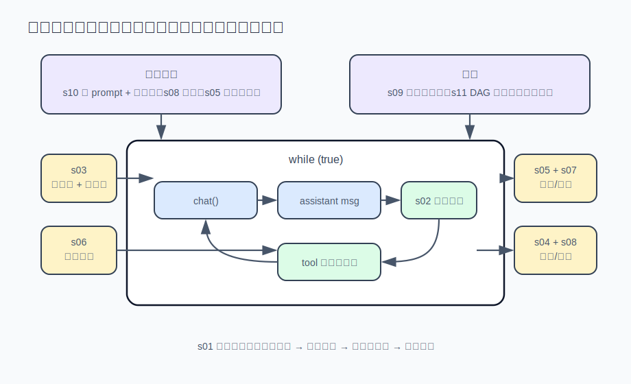

# learn-agent · AI Agent 开发笔记

**简体中文** · [English](./README_EN.md)

开发桌面 agent [Reina](https://github.com/Reina-Agent/Reina) 过程中记下的笔记，讲 coding agent（Claude Code、Codex、opencode 这类工具）的内部实现机制。每篇讲一个机制，把 Reina 里的生产实现简化成零依赖、单文件、可直接运行的 Node 程序——所以这些做法不是照 API 文档推想的，是实际产品里验证过的。



## 运行

Node 18+，零依赖：

```sh
git clone https://github.com/7-e1even/learn-agent && cd learn-agent
AGENT_API_KEY=sk-xxx node s01_agent_loop/agent.mjs
```

任何 OpenAI 兼容的 API key（DeepSeek / Kimi / GLM / OpenRouter / 本地 Ollama）都行；没有 key 的话，多数章节的 `demo.mjs` 和 [s12](./s12_full_agent/) 的自测模式不需要 key。

## 目录

s01–s12 从零搭出一个完整可用的 agent，按顺序读；s13 之后是开发 Reina 时陆续踩到、记下来的边界问题，挑感兴趣的读。每篇结尾附 Reina 中对应生产实现的位置。

| #                                 | 主题               | 要解决的问题                       |
| --------------------------------- | ---------------- | ---------------------------- |
| [s01](./s01_agent_loop/)          | Agent 主循环        | 最小可用的 agent 长什么样             |
| [s02](./s02_tool_system/)         | 工具系统             | 工具越加越多，怎么不用每次都改循环            |
| [s03](./s03_loop_budget/)         | 循环预算与纠偏          | 模型原地打转、反复报错，怎么发现并拉回来         |
| [s04](./s04_output_budget/)       | 工具输出预算与溢出        | 一条 `cat` 的输出就能撑爆上下文，怎么办      |
| [s05](./s05_streaming_interrupt/) | 流式输出与中断          | 用户按下 Ctrl+C，断在一半的消息记录怎么修     |
| [s06](./s06_compaction/)          | 上下文压缩            | 上下文满了要压缩，怎么不忘掉最初的任务          |
| [s07](./s07_prompt_cache/)        | Prompt 缓存        | 同样的对话，为什么有人的账单贵 10 倍         |
| [s08](./s08_persistence/)         | 会话持久化与恢复         | 进程崩了，跑了半小时的会话怎么接着跑           |
| [s09](./s09_subagent_watchdog/)   | 子代理与看门狗          | 子任务卡死了，怎么发现它并保住已完成的部分        |
| [s10](./s10_prompt_assembly/)     | System prompt 组装 | system prompt 越写越长，怎么按需拼装    |
| [s11](./s11_agent_team/)          | 多 agent 协作       | 几个 agent 同时干活，怎么分工不重复不冲突     |
| [s12](./s12_full_agent/)          | 完整 agent 整合      | 前面所有机制装回一个循环里是什么样            |
| [s13](./s13_permissions/)         | 权限与审批            | 模型要执行 `rm -rf`，怎么在动手前拦住      |
| [s14](./s14_provider_compat/)     | Provider 兼容层     | 换个模型 tool call 格式全乱，怎么兼容     |
| [s15](./s15_tool_disclosure/)     | 渐进式工具披露          | 工具有几十个，怎么不把上下文塞满             |
| [s16](./s16_moa/)                 | MoA 多模型合议        | 让多个模型一起商量，到底值不值              |
| [s17](./s17_self_evolution/)      | 自进化复盘环           | agent 能不能自己复盘对话，把学到的沉淀成记忆和技能 |
| [s18](./s18_completion_gate/)     | 自主任务的完成门         | agent 说"做完了"，凭什么信            |
| [s19](./s19_compaction_cache/)    | 压缩与缓存的冲突         | 压缩必然击穿缓存，怎么把损失降到最低           |
| [s20](./s20_memory_dream/)        | 自动长期记忆           | 跨项目自动沉淀该记住的事，不烧钱也不攒垃圾         |

---

发现事实错误或代码 bug 欢迎提 issue。[MIT License](./LICENSE) · © 2026 7-e1even
