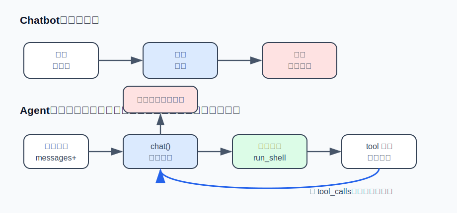

# s01 · Agent 主循环

你问 ChatGPT"帮我修这个 bug"，它只能把改好的代码贴给你——复制、运行、把报错粘回去，全得你自己来。而 Claude Code 能自己读文件、跑测试、改完再跑一遍验证。想写出这种"会动手"的程序，该从哪下手？

答案小得出乎意料：一个 while 循环，加一个能跑 shell 命令的工具。本章用约 120 行、零依赖的 Node 把它写出来，它是后续所有章节的基础。

## 什么是 agent

ChatGPT 的交互方式：你说一句，它答一句，结束。这是 chatbot。

Claude Code 的交互方式：你说"帮我修这个 bug"，它自己去读文件、跑测试、改代码、再跑测试，最后回来告诉你结果。这是 agent。

剥掉"自主性"、"任务规划"这些包装之后，两者的区别只有一个：

```
chatbot:  用户说 → 模型答 → 结束
agent:    用户说 → 模型答"我要先看看" → 代码替它执行 → 把结果喂回去
          → 模型再看 → ……如此循环 → 直到模型自己说"我说完了"
```

**决定循环继续还是停止的，是模型，不是代码。** 代码唯一的工作是：模型要用工具，就执行，然后把结果递回去。这就是"自主"的最小实现。



写完之后你可以直接跟它对话，它有一个 shell 工具，会自己决定什么时候用。

## 运行方式

```sh
# 任何 OpenAI 兼容的 key 都行：DeepSeek / Kimi / GLM / OpenRouter / 本地 Ollama
AGENT_API_KEY=sk-xxx node s01_agent_loop/agent.mjs

# 换模型：
AGENT_BASE_URL=https://api.moonshot.cn/v1 AGENT_MODEL=kimi-k2-0711-preview AGENT_API_KEY=sk-xxx node s01_agent_loop/agent.mjs
```

跑起来之后，对它说："看看当前目录，猜猜这是个什么项目"。你会看到一行黄色的 `$ dir`（或 `$ ls`）——那是模型自己决定调用工具。

## 代码走读

整个文件只有四块。

### ① 工具定义

```js
const TOOLS = [{
  type: "function",
  function: {
    name: "run_shell",
    description: "在用户的终端里执行一条 shell 命令，返回 stdout 和 stderr。",
    parameters: {
      type: "object",
      properties: { command: { type: "string", description: "要执行的命令" } },
      required: ["command"],
    },
  },
}];
```

这段 JSON 是写给模型看的说明书。模型读了 `description`，才知道有一个叫 `run_shell` 的工具可用，以及参数长什么样。起步只提供这一个工具就够了：能跑命令，就能读文件、写文件、查环境、跑测试。

System prompt（每次请求都附带的固定说明）里有个容易被忽略的细节：

```js
const SYSTEM = `...
当前目录：${process.cwd()}
操作系统：${process.platform}`;
```

把当前目录和操作系统写进去，是所有真实 agent 都做的事。模型不知道自己在哪台机器的哪个目录里，就会猜错路径、在 Windows 上跑 `ls`。

### ② runShell：错误处理

```js
function runShell(command) {
  try {
    return execSync(command, { encoding: "utf8", timeout: 30_000, ... });
  } catch (err) {
    // 不抛异常，把错误文本 return 给模型
    return `命令失败（exit ${err.status}）：\n${err.stdout ?? ""}${err.stderr ?? err.message}`;
  }
}
```

一个常见错误是：命令失败就抛异常、进程崩溃。但对 agent 来说，**工具失败不是事故，是信息**。模型看到"命令失败：'ls' 不是内部或外部命令"，下一轮会自己改用 `dir`。把报错喂回去，它会自己换路。这个原则贯穿整套笔记：错误流向模型，而不是打死进程。

### ③ chat()：API 调用

```js
async function chat(messages) {
  const res = await fetch(`${BASE_URL}/chat/completions`, {
    method: "POST",
    headers: { "content-type": "application/json", authorization: `Bearer ${API_KEY}` },
    body: JSON.stringify({
      model: MODEL,
      messages: [{ role: "system", content: SYSTEM }, ...messages],
      tools: TOOLS,
    }),
  });
  const data = await res.json();
  return data.choices[0].message;
}
```

不用 SDK，不用框架。agent 框架的底层就是一个 `fetch`。

### ④ runTurn()：主循环

```js
async function runTurn(messages) {
  while (true) {
    const msg = await chat(messages);
    messages.push(msg);

    if (msg.content) console.log(`\n${msg.content}`);
    if (!msg.tool_calls?.length) return;   // 模型不再要工具 => 这一轮结束

    for (const call of msg.tool_calls) {
      const args = JSON.parse(call.function.arguments || "{}");
      const output = call.function.name === "run_shell"
        ? runShell(args.command ?? "")
        : `未知工具：${call.function.name}`;
      messages.push({ role: "tool", tool_call_id: call.id, content: output });
    }
  }
}
```

这个 `while` 就是所有 coding agent 的主循环：

1. 问模型一次；
2. 模型的回复里带 `tool_calls`（工具调用请求）？——执行每一个，把结果以 `role: "tool"` 的消息回填进 `messages`，回到第 1 步；
3. 不带？——模型认为话说完了，把控制权交还用户。

两个容易踩的坑：`content` 和 `tool_calls` 可能同时存在（模型边说"我来看看目录"边调用工具），所以 content 要打印；`function.arguments` 是 JSON **字符串**不是对象，要 parse，而且 parse 失败也要把错误回给模型而不是崩溃（网络不稳时模型可能吐出不完整的 JSON）。

### 消息历史

```js
const messages = [];
while (true) {
  const line = await rl.question("\n你> ");
  messages.push({ role: "user", content: line });
  await runTurn(messages);
}
```

`messages` 数组就是 agent 的全部记忆。它只增不减，每次调用都要完整发给模型。现在它还小，问题不大，但**这个数组会一直长大**。s04（输出预算）、s06（压缩）、s07（cache 命中）要解决的问题，都源于这一点。

## 与真实产品对照

- 这 120 行和 Claude Code 的主循环在结构上是同一个东西。真实产品多出来的几万行，都花在这个循环的周边：工具更多更可靠（s02）、不空转（s03）、上下文不爆（s04/s06）、便宜（s07）、断了能接上（s08）、能分身（s09）。循环本身从 s01 到最后一章不再修改。
- 桌面 agent [Reina](https://github.com/Reina-Agent/Reina) 的引擎（`runTurn`）也是这个循环。它的 system prompt 同样以当前目录 + 平台开头。

## 练习挑战

给 agent 加第二个工具 `current_time`（返回当前时间字符串）。提示：TOOLS 数组加一项 + 执行分支加一个 `if`。

做完你会发现：加一个工具要改两个地方，容易失配。这正是下一章工具注册表要解决的问题。

---

| ← 上一章 | [目录](../README.md) | [下一章：工具系统 →](../s02_tool_system/README.md) |
|---|---|---|
