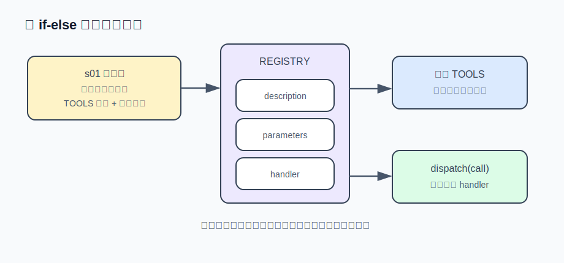

# s02 · 工具系统

本章解决 s01 遗留的问题：加一个工具要同时改 TOOLS 数组和执行分支，两处容易失配。解法是把工具收拢成注册表，并引入专用文件工具。

## 工具注册表

s01 的挑战题里，加一个 `current_time` 要改两个地方（TOOLS 数组 + 执行分支）。工具一多，这两处必然失配：在 TOOLS 里声明了工具却忘了写分支，模型调用后只会得到一句"未知工具"。

解法是把工具收拢成**注册表**：

```js
const REGISTRY = {
  run_shell: {
    description: "在用户的终端里执行一条 shell 命令……",
    parameters: { type: "object", properties: { command: {...} }, required: ["command"] },
    handler: ({ command }) => { ... },
  },
  read_file:  { description, parameters, handler },
  write_file: { description, parameters, handler },
  edit_file:  { description, parameters, handler },
};
```

每个工具是一个条目：给模型看的说明（description + parameters）和给机器执行的实现（handler）放在一起，不会失配。API 需要的 TOOLS 数组由注册表生成：

```js
const TOOLS = Object.entries(REGISTRY).map(([name, t]) => ({
  type: "function",
  function: { name, description: t.description, parameters: t.parameters },
}));
```

这就是**单一事实来源**（single source of truth）。调度也从 if-else 变成查表：

```js
function dispatch(call) {
  const tool = REGISTRY[call.function.name];
  if (!tool) return `未知工具：${call.function.name}`;
  let args;
  try { args = JSON.parse(call.function.arguments || "{}"); }
  catch (err) { return `工具参数不是合法 JSON：${err.message}`; }
  try { return tool.handler(args); }
  catch (err) { return `工具执行出错：${err.message}`; }
}
```

dispatch 把 s01 的"错误即信息"升级成了系统性约定：未知工具、坏参数、handler 抛异常，三条失败路径全部变成文本回给模型，任何一条都不打死进程。

从此加工具 = 加一个条目。主循环唯一的变化是把 if-else 换成 `dispatch(call)`，之后不再修改。真实产品都是这个形状——Claude Code、Codex，包括 Reina 的 `packages/tools/` 目录，本质都是一张注册表。



## 为什么需要专用文件工具

shell 理论上万能，但实践上让模型拼 `sed -i 's/old/new/' file` 改文件很不可靠：引号转义、正则元字符、跨平台差异（Windows 没有 sed）、多行文本，每一项都容易出错。**专用文件工具不是语法糖，是可靠性工程。**

### read_file：带行号输出

```js
const CAP = 50_000;
const body = text.length > CAP ? text.slice(0, CAP) + `\n…(截断，共 ${text.length} 字符)` : text;
return body.split("\n").map((line, i) => `${String(i + 1).padStart(4)}\t${line}`).join("\n");
```

带行号是为了模型能精确引用位置。那个 5 万字符的硬截断是个临时方案：如果文件有 2MB，截掉的部分模型永远看不到，它也不知道自己错过了什么。s04 会正面解决这个问题（预算 + 无损溢出）。

### edit_file：唯一匹配契约

```js
handler: ({ path: p, old_string, new_string }) => {
  const text = readFileSync(p, "utf8");
  const first = text.indexOf(old_string);
  if (first === -1)
    return `编辑失败：old_string 在 ${p} 中找不到。请先 read_file 确认原文。`;
  if (text.indexOf(old_string, first + 1) !== -1)
    return `编辑失败：old_string 在 ${p} 中出现多次。请带上更多上下文让它唯一。`;
  // 不能用 text.replace(old, new)：new_string 里的 $$ / $& 会被 JS 当替换模式展开，静默写坏文件。
  writeFileSync(p, text.slice(0, first) + new_string + text.slice(first + old_string.length));
  return `已编辑 ${p}`;
},
```

`edit_file` 的契约：**old_string 必须在文件中出现且仅出现一次**，否则拒绝执行。这也是 Claude Code 的 Edit 工具实际使用的契约。这样设计是因为它把"模型脑中的文件"和"磁盘上的文件"强制对齐：

- 匹配不到 → 说明模型的记忆过期了（文件被改过，或它记错了）→ 报错引导它先 `read_file` 刷新认知，而不是改错地方；
- 匹配到多处 → 说明定位有歧义 → 报错引导它带上更多上下文行，精确到唯一。

再看两条报错文案："请先 read_file 确认原文"、"请带上更多上下文让它唯一"。报错是写给模型看的界面：好的报错直接告诉模型下一步动作，模型照做就能自愈；坏的报错（"Error: -1"）只会让它原地打转。

为什么不用正则替换？因为正则转义是模型的常见出错点。字面量匹配 + 唯一性契约比正则可靠，这是各家产品从生产事故中得出的共同结论。

## 运行方式

```sh
AGENT_API_KEY=sk-xxx node s02_tool_system/agent.mjs
```

两个实验：

1. 工具组合：对它说"在 demo/ 下建一个 hello.js 打印当前时间，然后把打印内容改成中文，最后跑给我看"。你会看到 `write` → `edit` → `$ node` 三种黄色行依次出现——一条指令，模型自己编排了三种工具。另外，模型可能在一条回复里同时发多个 tool_calls，s01 写的 for 循环已经支持。
2. 触发唯一性检查：挑一个文件里出现多次的短语让它替换。观察 edit_file 报"出现多次"、模型带上更长的上下文重试成功——这是唯一匹配契约的现场演示。

## 与真实产品对照

- Claude Code 的 Edit 工具契约与本章 `edit_file` 相同（还多一个 `replace_all` 参数处理"全部替换"的场景，留作思考题）。
- Reina 的工具注册表在 `packages/tools/src/`，每个工具一个文件，形态和本章 REGISTRY 一致；它的 CLAUDE.md 里有一条规则："加新工具要注册进 tool registry，不许给引擎类加方法"——注册表一旦建立，就要守住它。
- CRLF 问题：Windows 文件是 `\r\n` 换行，模型给的 old_string 是 `\n`，会匹配不上。真实产品都遇到过。最简单的对策是让报错引导模型重试；更彻底的做法留作思考题。

## 练习挑战

加一个 `list_dir` 工具：列出目录内容，标注类型（文件/目录）和大小。

这次你只需要加一个条目。对比 s01 挑战题的体验，可以体会注册表的价值，也是"机制围着循环长，循环不变"的第一次兑现。

---

| [← 上一章：Agent 主循环](../s01_agent_loop/README.md) | [目录](../README.md) | [下一章：循环预算与纠偏 →](../s03_loop_budget/README.md) |
|---|---|---|
