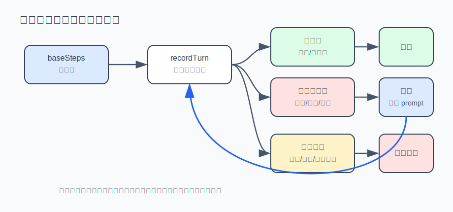

# s03 · 循环预算与纠偏

s01 的循环是 `while (true)`，退出条件掌握在模型手里。本章给循环加上预算和自动纠偏，防止模型陷入无效循环、无限消耗 token。

## 失控的三种模式

模型不喊停，循环就不停。典型场景：你让 agent 修一个测试，它跑一次失败，改一行，又跑，又失败，又把刚才那行改回去，再跑……几十分钟后消耗了大量 token，测试仍然是红的。

模型每一轮都真诚地认为下一次会成功。从外部看，失控有三种典型模式：

| 失控模式 | 表现 | 本质 |
|---|---|---|
| 复读机 | 一模一样的命令跑了 8 遍 | 卡在同一个想法里出不来 |
| 连环报错 | 每一轮的工具全在报错，还在换着花样试 | 撞墙了但没有意识到 |
| 原地踏步 | 动作不重复、也不报错，但全是读操作，世界没有任何变化 | 看起来在推进，实际没有进展 |

裸的 `while (true)` 对这三种情况没有防御。本章给循环装上看门狗。

## 运行方式（不需要 API key）

```sh
node s03_loop_budget/demo.mjs
```

四个剧本 agent 分别演示三种失控被暂停、以及正常推进的 agent 拿到续期。输出示例：

```
━━━ 场景一：复读机（同一动作反复执行） ━━━
  第 1 轮：run_shell({"command":"grep -r TODO ."})  [预算 1/6]
  ...
  第 4 轮：run_shell({"command":"grep -r TODO ."})  [预算 4/6]
  🟡 可纠偏暂停：同一个工具动作被反复执行，暂停。（reason=repeated_action）

━━━ 场景四：勤奋 agent（有进展就续期，直到硬顶） ━━━
  第 3 轮：edit_file(...)  [预算 3/6]
  第 4 轮：edit_file(...)  [预算 4/12]   ← 续期发生在这里
  ...
  第 25 轮：⛔ 达到硬性上限，强制停止。（reason=hard_max_steps）
```

## 设计：四个关键决定

看门狗的完整实现在 [loop-budget.mjs](./loop-budget.mjs)，不到 150 行。它是从真实产品 Reina 的 `loop-budget.ts` 简化移植的，机制一致。四个设计决定值得展开：



### ① 预算是软的：有进展就续期

一刀切的"最多 20 轮"是坏设计：重构任务干到一半被中断，体验很差。正确形状是**软预算 + 硬顶**：

```js
// 有进展、且预算只剩 2 轮 → 再给一份 baseSteps（封顶 hardMax = 4 倍）
if (hasProgress && this.turns >= this.budget - 2 && this.budget < this.hardMaxSteps) {
  this.budget = Math.min(this.hardMaxSteps, this.budget + this.baseSteps);
}
```

正常推进的 agent 不受惩罚，失控的 agent 也不会无限消耗——硬顶是最后的兜底。

### ② 进展的判定：写操作算，重复读不算

```js
function isProgress(record, actionCount) {
  if (record.status !== "completed") return false;
  if (["write_file", "edit_file"].includes(record.name)) return true; // 写 = 永远算
  return Boolean(record.output?.trim()) && actionCount === 1;         // 读 = 只有第一次算
}
```

这个启发式很粗，但方向明确：**改变了外部状态的动作才算进展**。写文件改变了状态；第一次读到新信息也算（认知变了）；第二次跑同一条命令、读同一个文件——状态没变，结果也早已知道，不算。

### ③ 动作指纹：识别"同一个动作"需要稳定序列化

重复动作探测靠给每个动作记指纹：

```js
const key = `${record.name}:${stableStringify(record.input)}`;
```

注意是 `stableStringify`（key 排序后再序列化），不是裸 `JSON.stringify`。模型两次生成的参数对象字段顺序可能不同（`{a,b}` vs `{b,a}`），语义上是同一个动作，裸 stringify 会把它们当成两个，探测直接失效。

### ④ 熔断前先给一次纠偏机会

看门狗触发后最简单的做法是直接停。但三种行为异常（复读/停滞/连环报错）往往只是模型缺少外部视角。所以真实产品的做法是先注入一条纠偏 prompt：

```
自动纠偏触发：同一个工具动作被反复执行，暂停。
循环状态：原因=repeated_action，已用 9 轮，预算 12，硬顶 48。
不要再重复同样的工具调用或失败的命令。先总结目前发生了什么、找出卡点，
换一条不同的路。如果任务被阻塞或有歧义，向用户提一个具体的问题，而不是继续空转。
```

这条 prompt 的三段结构各有作用：说清发生了什么（模型自己意识不到在重复）、给出禁止项（别再重复）、给出出路（换路，或者问用户）。注入之后模型往往能跳出来。

纠偏只给一次。再次熔断，或预算真正耗尽（`max_steps` / `hard_max_steps`），就停止本轮、把控制权交还用户——此时应由人来决定，而不是继续消耗。

## 接进你的 agent

[agent.mjs](./agent.mjs) 是 s02 的 agent + 看门狗，主循环的全部变化：

```js
async function runTurn(messages) {
  const budget = new LoopBudget({ baseSteps: 12 });
  let repaired = false;
  while (true) {
    if (!budget.canContinue()) { /* 预算耗尽 → 停止 */ }

    const msg = await chat(messages);
    // ...执行工具，同时收集 records: [{ name, input, status }]

    const stop = budget.recordTurn(records);
    if (!stop) continue;
    if (isRecoverable(stop) && !repaired) {
      repaired = true;
      messages.push({ role: "user", content: repairPrompt(stop) }); // 注入纠偏提示
      continue;
    }
    return; // 纠偏用过了还熔断 → 交还用户
  }
}
```

循环的骨架没变——看门狗是挂在循环上的，不是写进循环里的。

## 与真实产品对照

本章机制对应 Reina 的 `packages/core/src/loop-budget.ts`（生产阈值：停滞 8 轮、重复动作 10 次、连续报错 5 轮，均可用环境变量覆盖；预算耗尽时最新的工具结果会被完整保留进下一轮，避免停下来后丢失刚发生的上下文）。Claude Code 里偶尔出现的 "Paused after several tool turns without new progress" 提示，背后就是这类机制。

另外注意一个分工：本章的看门狗管的是**行为失控**（无效循环）。还有一类失控是物理卡死——工具进程 hang 住、模型流断了，循环根本转不动，行为探测器永远等不到下一轮。那需要另一条看门狗（心跳 + 超时 + 终止前保留输出），在 s09 子代理章介绍。

## 练习挑战

1. 给 `isProgress` 加一条规则：`run_shell` 跑 `git commit` 这类明确改变外部状态的命令，即使是第二次也算进展。想想怎么判定"改变外部状态的命令"（提示：白名单前缀即可，不必过度设计）。
2. 思考题：纠偏 prompt 是以 `role: "user"` 注入的——模型会把它当成用户说的话。有什么副作用？如果换成 system 消息或 tool 消息，各有什么问题？（这个问题没有标准答案，真实产品各有取舍。）

---

| [← 上一章：工具系统](../s02_tool_system/README.md) | [目录](../README.md) | [下一章：工具输出预算与溢出 →](../s04_output_budget/README.md) |
|---|---|---|
