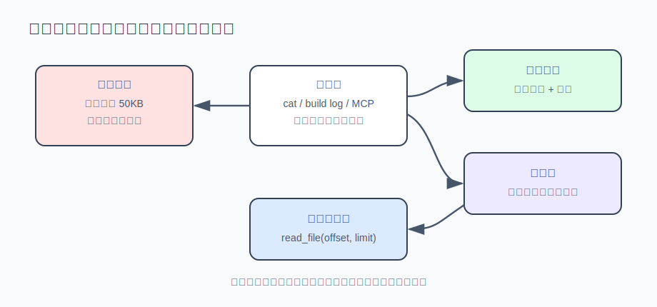

# s04 · 工具输出预算与溢出

工具输出可能大到撑爆上下文窗口。本章给它设预算，超预算的部分完整落盘，对话里只留一张"取件条"。本章代码 = s03 基底 + 溢出机制模块 [spill.mjs](./spill.mjs)。

## 问题

你让 agent 检查一个导出文件，它顺手执行了 `cat data.json`——一个 2MB 的文件。轻则这轮请求直接失败：2MB 约等于五十多万 token，超出模型一次能读的上限（上下文窗口），API 返回 400；就算窗口装得下，这五十万 token 也从此留在对话历史里，每一轮都重新计费——一次 cat，成本翻倍。

s02 给 `read_file` 加过一个 50KB 截断。但截掉的部分模型永远看不到，它也不知道自己错过了什么——如果问题恰好在第 51KB，就查不出来了。这三种坏结局（撑爆窗口、持续计费、截断丢信息）的共同根源是：**模型每轮能看到多少，完全没有预算约束**。

## 解决方案

给工具输出设预算，超出的部分完整存到磁盘（落盘），对话里只留一张"取件条"——写明存在哪、有多大、怎么取——不丢任何信息。

解法不是截得更狠。截断和溢出是两种思路：

| | 截断 | 溢出 |
|---|---|---|
| 超限的部分去哪了 | 删除——永远消失 | 落盘——完整保存 |
| 模型知道自己错过了什么吗 | 不知道 | 知道：指针写明全文在哪、有多大、怎么取 |
| 需要细节时 | 只能重跑命令（贵，还可能不可重现） | `read_file` 分段取回 |



## 运行

不需要 API key：

```sh
node s04_output_budget/demo.mjs
```

三个场景，真实输出节选：

```
━━━ 场景一：单条 2MB 输出（模拟 cat 大文件）━━━
  原始输出：2097212 字符
  回给模型：2144 字符（压到 0.10%）
  落盘全文：.agent-spill\1783040027411-7dc4a787.txt

━━━ 场景二：一轮 4 条输出合计超总量（largest-first 溢出）━━━
  整轮总量：150000 → 92140 字符（预算 100000）
  ⤵ 溢出  run_shell(git log)：60000 → 2140 字符
  · 保留  run_shell(grep -r)：30000 → 30000 字符
  · 保留  run_shell(ls -laR)：30000 → 30000 字符
  · 保留  read_file(src/app.js)：30000 → 30000 字符（read_file 不落盘副本，自带 offset/limit）

━━━ 场景三：vitest 风格日志的重要性压缩 ━━━
  394 行 → 13 行，省 97.0%（错误行一行没丢）
  压缩后的中段（FAIL 块完整保留）：
     FAIL  src/billing.test.ts > charges the right amount
     AssertionError: expected 1099 to be 999
         at src/billing.test.ts:42:15
```

有 key 的话跑 `AGENT_API_KEY=sk-xxx node s04_output_budget/agent.mjs`，让它 cat 一个大文件——你会看到紫色的 `⤵ 溢出` 行，然后模型拿着指针自己去 read_file 取细节。

## 实现

四个关键决定。

### ① 指针的三要素：在哪、多大、怎么取

溢出后回给模型的不是一句"(已截断)"，而是头尾节选加一条指针（那张取件条）：

```
row 26830: id=187810 name=user_26830 email=user_26830@example.com status=active
[输出超过预算：全文共 2097212 字符，已完整保存到 .agent-spill\1783040027411-7dc4a787.txt。
需要被省略的部分时，用 read_file（配 offset/limit）分段读取，不要重跑命令。]
```

三个要素缺一不可：**在哪**（路径），**多大**（模型据此决定要不要读、分几段读），**怎么取**（read_file + offset/limit，外加一句"不要重跑命令"——没有这句，模型的第一反应往往是把 cat 再跑一遍）。报错和提示都是写给模型看的界面（s02 的原则）：指针写清楚，模型照做就能取回细节；不需要就省下 token。

### ② 预算要两层：单条上限 + 整轮总量

只设"单条不超过 50KB"防不住：模型一轮发起十个工具调用，每条 30KB，单条都不超限，合计 300KB 照样超窗。所以预算是两层的，溢出从最大的一条开始（largest-first）：

```js
// spill.mjs —— 候选按体积从大到小排；「这条超单条上限」或「整轮总量还超标」
// 就溢出这一条，直到两个条件都满足为止。
for (const record of candidates) {
  if (record.output.length <= perResult && total <= turnTotal) break;
  const { content, file } = spillOne(record.output, { preview, dir });
  total -= record.output.length - content.length;
  record.output = content;
}
```

从最大的开始效率最高：溢出一条 60KB 通常就能让整轮回到预算内，剩下三条 30KB 原文保留，细节仍在上下文里。达标就停——预算的目的是保住窗口，不是压缩所有输出。

### ③ read_file 是特例：文件本身就是指针

`enforceTurnBudget` 跳过了 `spillable: false` 的条目。`read_file` 读出来的内容本来就在磁盘上，再落盘一份副本是浪费。它的正确形状是自我设限：

```js
// agent.mjs —— 替换掉 s02 的 50KB 截断
const slice = lines.slice(start - 1, start - 1 + limit);
// ……
body += `\n…(文件共 ${lines.length} 行，本次返回第 ${start}–${end} 行；继续读用 offset=${end + 1})`;
```

`offset/limit` 分段读取，尾注告诉模型总量和续读位置。同一个思想的两种形态：内存里的大输出 → 落盘 + 指针；磁盘上的大文件 → 指针就是它自己。所有大内容最终收敛到同一个动作：read_file 分段读取。

### ④ 日志先压缩，再计预算

测试/构建日志是大输出里最常见的一种，其中大部分是噪声——成百行 `✓ passed`、进度条、下载提示。有信号的只有错误、失败总结和它们旁边的堆栈。所以在预算之前先做一道按重要性的压缩：

```js
// spill.mjs —— 按行分三类
// anchor：错误/警告/总结行，永远保留，连同前后 2 行上下文
// trace ：堆栈帧，挨着保留行时整块保留（堆栈只有完整才有用）
// noise ：其余，成片折叠成 "… [N 行省略]"
```

两条保险规则：行数太少不处理（太短没有压缩价值）；省不到 15% 就原样返回（为 3% 的收益打乱原文格式不划算）。宁可多留几行噪声，也不折叠掉一行真错误。

压缩会不会丢信息？不会——折叠真的发生时，全文同样落盘、同样给指针。压缩决定"回给模型多少"，落盘保证"完整保存"。

## 练习

1. 现在的 `excerpt` 固定"头部为主、尾部 200 字符"。对失败的测试日志这个比例是错的——总结和 exit code 在尾部。给 `spillOne` 加一个 `mode: "head" | "tail"` 参数，让 `run_shell` 的失败输出保尾部。判定"该保哪头"的信号已经在 records 里了（提示：`status`）。
2. 一场长会话会在 `.agent-spill/` 里积累几十个文件，谁来删？设计一个清理策略并想清楚什么时候删是安全的——指针还留在 messages 历史里时删掉文件，模型按指针去读就会失败。（这个问题在 s06 会更突出：压缩历史时，指针是保还是弃？）

## 与真实产品对照（延伸阅读）

本章是 Reina 输出管线的简化版，生产实现分两层：

- **工具层**（`packages/tools/src/utils.ts`）：每个内置工具的输出上限 50KB / 2000 行；shell 输出保留尾部（exit code 和失败总结都在结尾），全文落盘到 `.reina/tool_outputs/` 并附 read_file 指针。
- **引擎层**（`packages/core/src/engine.ts` 的 `enforceTurnObservationBudget`）：每个请求前跑一遍整轮观测预算——单条超 100,000 字符、或整轮总量超 200,000 字符时 largest-first 溢出（小窗口模型按窗口的 15% / 30% 缩放）；替换成头尾节选 + `.reina/tool_outputs/<callId>.txt` 指针。这层聚合预算有一个很现实的动机：MCP（接入外部工具的协议）这类外部工具的输出不经过你的单条截断——外部工具不受你控制，聚合预算是它们唯一的兜底。另有一个 24,000 字符的紧急裁剪，只在请求即将超出窗口时启用——那是有损的最后手段，但它也带指针，不留死路。

"read_file 不落盘副本"这条特例是踩过坑的：Reina 早期版本给 read_file 的输出也落盘了一份副本，纯属浪费，后来修掉了。

日志压缩在 `packages/tools/src/log-compress.ts`（从 headroomlabs/headroom 的 Rust 实现移植），比本章多一个细节：把行里的数字/十六进制地址归一化后，相邻近似重复的行折叠成 `(line) ×N`。真实 vitest 输出实测省约 65%；eslint 输出则是 safe no-op——省不到 15% 阈值，原样返回。`REINA_LOG_COMPRESS=0` 可整体关闭。

Claude Code 的同类行为：Bash 工具输出超过 30,000 字符会截断——超长命令后看到的 "output truncated" 就是它的观测预算在工作。

---

| [← 上一章：循环预算与纠偏](../s03_loop_budget/README.md) | [目录](../README.md) | [下一章：流式输出与中断 →](../s05_streaming_interrupt/README.md) |
|---|---|---|
