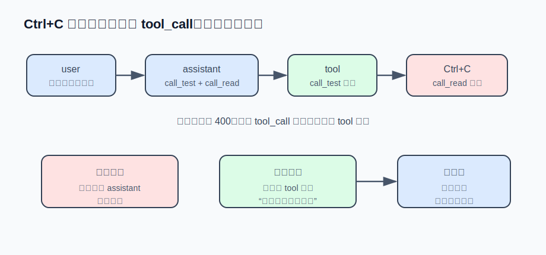

# s05 · 流式输出与中断

本章解决两个问题：把模型输出改为流式逐字显示；以及在用户按 Ctrl+C 中断后，让会话仍能正常继续。

本章代码 = s03 基底 + 流式解析与中断修复模块 [stream.mjs](./stream.mjs)。

## 问题：中断会破坏消息序列

非流式的 agent 在模型思考期间没有任何输出，用户无法判断它是否还在工作。解法是流式输出，逐字打印。

加上流式之后，通常还会加 Ctrl+C 中断（跑错方向的任务需要能停）。这带来第二个问题：中断之后再发一条消息，API 会返回 400。

看一下 Ctrl+C 那一刻的消息序列：

```
user:      "把测试跑一遍，顺便看下 README"
assistant: tool_calls: [call_test → run_shell, call_read → read_file]
tool:      (call_test 的结果 —— 第一个工具跑完了)
                     ← Ctrl+C 落在这里，call_read 永远没有结果
```

OpenAI 协议要求：assistant 消息里的每个 `tool_call`，后面都必须跟一条对应 `tool_call_id` 的 `tool` 消息。上面的序列中 `call_read` 没有对应结果——原样发出去，OpenAI 兼容后端会拒收（OpenAI 的报错原文大意是 "An assistant message with 'tool_calls' must be followed by tool messages responding to each 'tool_call_id'"；Anthropic 的版本是 "tool_use ids were found without tool_result blocks"）。

另外，流是中途被切断的，`call_read` 的 arguments 可能停在 JSON 中间（`{"path":"READ`）。如何处理这个残缺序列，决定了中断之后会话能否继续。



## 设计：四个关键决定

### ① SSE 解析：按行缓冲，而不是按 chunk 处理

先解释 SSE（Server-Sent Events）：`stream: true` 时，服务端不再一次性返回完整回答，而是保持一条 HTTP 响应打开，把回答切成小片逐个推送。每片是文本流里的一行：

```
data: {"choices":[{"delta":{"content":"我来"}}]}

data: {"choices":[{"delta":{"content":"查一下"}}]}

data: [DONE]
```

`data: ` 开头是数据行，空行是事件分隔符，`data: [DONE]` 表示结束。看起来逐行 parse 即可，但"行"不是你收到的单位：TCP 和中间代理切分数据时不考虑语义，`for await` 拿到的一个 chunk 可能停在 `data: {"cho` 的中间，甚至停在一个 UTF-8 多字节字符的中间。所以解析器必须按行缓冲（[stream.mjs](./stream.mjs)）：

```js
buffer += decoder.decode(chunk, { stream: true }); // stream 模式：不完整的多字节字符先保留
let newline;
while ((newline = buffer.indexOf("\n")) !== -1) {  // 凑齐完整的一行才处理一行
  const line = buffer.slice(0, newline).replace(/\r$/, "");
  buffer = buffer.slice(newline + 1);
  if (!line.startsWith("data:")) continue;          // 空行、": 心跳" 注释行，都跳过
  // ...
}
```

### ② tool_calls 分片：按 index 装配

content 的 delta 是字符串，直接拼接即可。tool_calls 的 delta 是被切碎的 JSON 字符串：第一片带 `id` 和函数名，后续片只带 `arguments` 的几个字符；并行调用时多个 call 的分片会交错到达，靠 `index` 归位：

```js
for (const tc of delta.tool_calls ?? []) {
  const slot = (toolCalls[tc.index] ??= { id: "", type: "function", function: { name: "", arguments: "" } });
  if (tc.id) slot.id = tc.id;
  if (tc.function?.name) slot.function.name += tc.function.name;
  if (tc.function?.arguments) slot.function.arguments += tc.function.arguments;
}
```

常见错误：每收到一片就对 `arguments` 做 `JSON.parse`——必然失败，因为 `{"comm` 不是合法 JSON。**装配阶段只做拼接，parse 留到拼完之后**（我们的 `dispatch` 本来就是那时才 parse 的，这是 s02 分层带来的便利）。

### ③ 中断信号的传递：一个 AbortController 贯穿 HTTP 层与工具循环

中断不能只设一个布尔标志位——正在传输的 HTTP 流不会检查标志位。`AbortController` 的 signal 传给 `fetch`，abort 时连接立即断开；断开会让 body 迭代器抛错，以 `signal.aborted` 为准吞掉这个错误，装配器里已有的半截消息照常返回（已经流出来的内容用户看到了，历史里也要有，否则模型下一轮缺失这段上下文）。

中断还可能落在两次工具执行之间，所以每次派发前重新检查：

```js
for (const call of msg.tool_calls) {
  if (controller.signal.aborted) break; // 剩余调用不跑，悬空部分交给修复函数
  // ...
}
```

Ctrl+C 的策略是第一次中断本轮、第二次退出进程——"停下这一轮"和"退出程序"是两个意图，分开处理。另有一个 readline 细节：终端在 readline 手里时处于 raw 模式，Ctrl+C 不产生进程信号，而是触发 `rl` 的 `'SIGINT'` 事件——所以 `rl.on("SIGINT")` 和 `process.on("SIGINT")`（非 TTY 时）都要监听。

### ④ 悬空 tool_call 的修复：回填合成结果

残缺序列有三种处理方式：

| 做法 | 结果 |
|---|---|
| 把半截 assistant 消息整个丢掉 | 不会 400，但用户看到的那半截回答不在历史里，下一轮模型缺失上下文 |
| 原样保留，直接发 | 400 |
| **保留 + 回填合成 tool 结果** | 序列配平，会话继续 |

回填就是给每个悬空的 tool_call 插一条合成的 tool 消息。文案经过设计（参考 s02：报错是写给模型看的界面）：

```
(用户中断了执行，该工具未运行——不是工具失败，需要时可以重新调用)
```

明确说"不是失败"，模型不会误判为工具故障而绕路；明确说"可以重新调用"，用户说"继续"时它知道从哪接。同时修复第二处损坏：断在 JSON 中间的 arguments 改为 `{}`（部分后端会校验历史里的这段字符串）。修复函数是幂等的——对配平的序列是无操作，重复执行安全。

## 运行方式（不需要 API key）

```sh
node s05_streaming_interrupt/demo.mjs
```

输出节选——先看分片装配（整段 SSE 字节流每 31 字节切一次，故意切在 `data:` 行和 JSON 的中间）：

```
━━━ 场景一：SSE 分片装配（tool_calls 按 index 归队）━━━
  线路上：11 个事件被切成 30 个原始分片，比如：
    分片[0] = "data: {\"choices\":[{\"delta\":{\"ro"
    分片[1] = "le\":\"assistant\"}}]}\n\ndata: {\"ch"
  实时打印的文本："我来查一下。"
  装配出的 tool_calls（arguments 拼完才 parse）：
    call_ls → run_shell({"command":"ls -la"})
    call_read → read_file({"path":"a.txt"})

━━━ 场景二：Ctrl+C 撕裂的消息序列，修复后能继续对话 ━━━
  修复前：user → assistant+2calls → tool(call_test)
    悬空：call_read 没有 tool 结果；参数断裂："{\"path\":\"READ"
  修复后：user → assistant+2calls → tool(call_read) → tool(call_test)（回填 1 条）
    合成结果："(用户中断了执行，该工具未运行——不是工具失败，需要时可以重新调用)"
    参数修复："{}"
  再跑一遍修复（应当无操作、幂等）：回填 0 条
```

有 key 的话运行 `AGENT_API_KEY=sk-xxx node s05_streaming_interrupt/agent.mjs`，给它一个多步任务，中途按 Ctrl+C，然后问"刚才做到哪了"——能接上即为验收通过。

## 真实产品对照

Reina 的对应机制在 `packages/providers/src/tool-pairing.ts`：`normalizeToolPairing` 做**双向配平**——除了本章的"悬空 call 合成占位输出"（合成文案同样说明"可能被中断丢失，需要时重跑"），还处理反方向的"孤儿结果"：一条 tool 结果找不到发起它的 call，同样会被后端拒收（"No tool call found for function call output with call_id ..."）。codex 的做法是把孤儿直接丢弃；Reina 把它降级为普通文本消息——因为 Reina 的孤儿消息里常含有真实信息，直接丢弃会损失内容。这套修复在生产里静默执行，但 `REINA_STRICT_TOOL_PAIRING=1` 时会直接抛错——配平失守说明上游某个不变量被破坏，开发环境里应当尽早暴露。

引擎侧的中断在 `packages/core/src/engine.ts`：`interrupt()` 除了 abort，还会立刻换上一个新的 AbortController 并清空待处理队列——这曾引出一个隐蔽 bug：换新之后，工具批次里尚未执行的调用读到的是新 controller 的未中断 signal，会照常执行；所以 Reina 在批次内每次派发前检查的是 `session.interrupted` 标志位，而不是 signal。另外中断不只有 Ctrl+C 一种：进程崩溃、断电也是中断——`recoverInterruptedTurn()` 在重新加载会话时检测"卡在 running 状态的工具调用"，统一标记失败并回填错误文案。这依赖会话落盘，见 s08。

## 练习挑战

1. 中断有时过重——用户只是想补一句"顺便用 --verbose 跑"，不想丢弃正在生成的回答。codex 和 Reina 都支持 steer：不打断当前流，把用户插话排队，等本轮迭代提交后作为下一条 user 消息注入。给本章 agent 加上这个能力：轮次进行中输入的文字不触发中断、进入队列（提示：难点在插入位置——工具结果和插话的先后顺序，想想为什么插在 tool 结果之后比之前安全）。
2. 思考题：合成结果的文案，"(用户中断了执行，该工具未运行)" 与 codex 风格的单词 "aborted"，各会把模型引向什么行为？构造一个"中断后用户说『继续』"的场景，推演两种文案下模型的下一步动作差异。

---

| [← 上一章：工具输出预算与溢出](../s04_output_budget/README.md) | [目录](../README.md) | [下一章：上下文压缩 →](../s06_compaction/README.md) |
|---|---|---|
