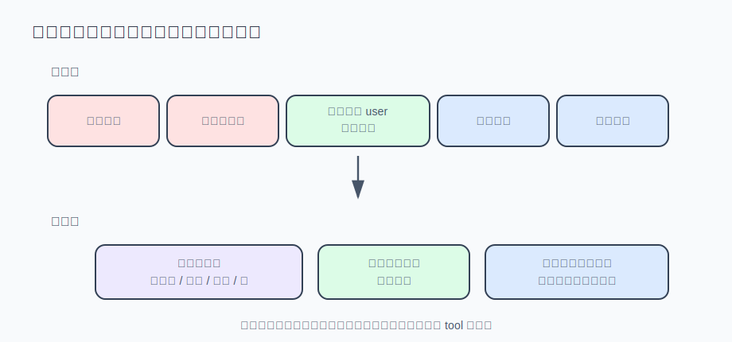

# s06 · 上下文压缩

历史只增不减，迟早超过模型一次能读的上限。本章实现压缩器，并解决它自带的隐蔽问题。

本章代码 = s03 的最小 agent 循环 + compaction.mjs 压缩器（每轮结束检查触发）。

## 问题

你让 agent"把 utils/date.js 的 formatDate 改成支持时区，改完跑测试"。五十多轮工具调用后，API 突然拒收：`This model's maximum context length is 131072 tokens...`——历史只增不减，超过了模型一次能读的上限（上下文窗口）。

解法是压缩：把旧消息换成摘要。但压缩自带一个隐蔽问题：摘要是模型写的，转述必然走样——第一次压缩，你的指令变成"用户在重构日期工具函数"；再压一次，变成"用户在优化项目代码"——最后 agent 停下来问你想做什么。它没报错，只是把指令转述丢了。

## 解决方案

压缩不是"全部换成摘要"：用模型生成的结构化摘要替换中段历史，同时逐字保留启动本轮任务的用户消息、原样保留最近的尾部（模型正在用的工作记忆）。既然转述会走样，有些内容必须**逐字**保留过压缩。

触发时机用服务商报告的 usage 判断，不自己数 token；摘要让模型按栏目填写，不是笼统总结；摘要模型调用失败时降级为纯字符串处理的提取式摘要——压缩不能因摘要失败而毁掉会话。



## 运行

免 key 演示：

```sh
node s06_compaction/demo.mjs
```

四个场景：触发判定、切片决策、摘要失败降级、回退/分支后压缩产物的去留。

接上真实模型：

```sh
AGENT_API_KEY=sk-xxx node s06_compaction/agent.mjs
# 可选：AGENT_CONTEXT_WINDOW=128000 AGENT_COMPACT_PERCENT=75
```

窗口大小在标准协议里没有字段可查，只能自己配置（见文末）。想观察压缩，把 `AGENT_COMPACT_PERCENT` 调到 5，让它连续读几个大文件。切片决策输出节选（真实运行）：

```
━━━ 场景二：切片决策（保什么 / 压什么 / 启动消息逐字保留） ━━━
  共 27 条消息。只看"尾部保底 8 条"，该从第 19 条切——
  但那样启动任务的用户消息（第 6 条）就会被摘要转述掉。
  分割点回拉到最后一条真实用户消息：实际 keepFrom = 6。逐条判决：
    [ 0] 🗜️ 压缩  user      这个仓库的测试是怎么组织的？大概讲讲。…
    ...
    [ 6] 📌 保留 ←启动消息，逐字  user      帮我把 utils/date.js 里的 formatDate 改成支持时区参数 tz，默认 UTC…
    [ 7] 📌 保留  assistant → run_shell({"command":"rg -n formatDate src utils"}…)
    ...
  压缩完成：27 条 → 22 条（压掉 6 条，降级=false）

━━━ 场景三：摘要模型挂了（超时/限流），压缩绝不能毁掉会话 ━━━
  摘要调用抛出 429 → 自动降级为提取式摘要（degraded=true），会话照常继续。
```

## 实现

### ① 触发时机：用服务商报告的 usage，不自己数 token

第一反应是自己算 token 数。但你没有服务商的分词器，本地估算（tiktoken 也一样）只是近似，中文误差可超 15%。估少了会在真实窗口边界撞出 `context too long`，来不及压缩。

正确做法零成本：每次响应都带 `usage`，是服务商报告的准确数字。`total_tokens` 约等于下一轮要携带的全部历史，超过窗口阈值（默认 75%）就压缩：

```js
// 流式调用需在请求里加 stream_options: {"include_usage": true}，
// usage 才会出现在流的最后一片——不加则拿不到用量，压缩永远不会触发
const used = usage.total_tokens ?? (usage.prompt_tokens ?? 0) + (usage.completion_tokens ?? 0);
const threshold = Math.floor((contextWindow * triggerPercent) / 100);
if (used >= threshold) /* 触发压缩 */;
```

留 25% 余量：压缩本身还要调一次模型、摘要也占空间，得在仍有余地时动手。

### ② 压缩的形状：三段式，启动消息逐字保留

压缩不是"全部换成摘要"。正确形状是三段：

```
[system]                        ← 不动（它本来就不在 messages 里）
[中段历史]                       → 换成模型生成的结构化摘要
[启动本轮任务的用户消息]           → 逐字保留 ★
[最近的尾部消息]                  → 原样保留（模型正在用的工作记忆）
```

尾部是模型的工作记忆，压掉等于打断手头操作。**启动消息逐字保留**是本章核心：压缩总在工具循环中途触发，"最近 N 条"全是工具结果，原始指令恰好落在被压缩区——被转述后，模型从此在转述版指令上工作（真实产品踩过同坑）。

实现是把分割点回拉到最后一条真实用户消息：

```js
let keepFrom = messages.length - keepRecent;
const lastUser = messages.findLastIndex(isRealUser);
if (lastUser >= 0 && lastUser < keepFrom) {
  if (charsOf(messages.slice(lastUser)) <= maxAnchorChars) keepFrom = lastUser;
}
// 切口不能落在 assistant(tool_calls)/tool 一对中间，否则下轮请求 400
while (keepFrom > 0 && messages[keepFrom].role === "tool") keepFrom--;
```

注意 `isRealUser`：历史里的 user 消息不全是用户说的——s03 看门狗注入的纠偏消息、上次压缩留下的摘要也是 `role:"user"`。锚点停在它们身上，指令仍会丢，所以按已知前缀（`[上下文压缩]`、`自动纠偏触发：`）排除合成消息。

回拉有上限：启动消息若在几百条之前，全保留就腾不出空间——超限时放弃，由下一条兜底。

### ③ 摘要 prompt：按栏目填写，不是笼统总结

"总结一下上面的对话"得到的是泛泛叙述，丢的恰好是接续任务最需要的信息。让模型按栏目填写，每栏对应压缩后第一轮会用到的内容：

```
1. 任务目标：用户让你做什么。逐字引用用户原话，禁止转述。
2. 已完成：做了哪些事、各自的结论。
3. 未完成 / 待办：接下来该做什么，按优先级排。
4. 涉及的文件与关键命令：完整路径和完整命令，逐字保留。
5. 关键决定与踩过的坑：为什么选了这条路，哪些路已被证明走不通。
```

第 1 栏的"逐字引用"是决定②的双保险：即使启动消息因超长没能逐字保留，原话也还在摘要里。第 5 栏容易被忽略：不记录走不通的路，模型会把失败路径重走一遍。

### ④ 摘要失败时的降级

摘要要调一次模型，而调用可能限流、超时、断网。此刻会话已接近窗口上限，下轮再试来不及——**压缩不能因摘要失败而毁掉会话**。所以要一条不会失败的降级路径：提取式摘要，纯字符串处理，截每条消息首尾拼成骨架：

```js
try {
  summary = await summarize(toSummarySource(middle));
} catch {
  degraded = true;
  summary = extractiveSummary(middle); // 不智能，但零依赖、不会失败
}
```

有损的记忆也比崩溃的会话好。

### ⑤ 回退与分支：压缩产物随切点走，不是易失缓存

聊天产品迟早要做"撤回 / 从这条消息创建分支"。此时会话有两份历史：完整文字稿（渲染层展示用，从未被压缩）和模型视图（压缩后的 [摘要 + 尾部]，新消息双写进两份）。回退最顺手的实现，是从完整文字稿重建、把摘要当派生缓存清掉——反正超阈值还会再压。这个"反正"就是坑：会话长到压缩过，裁到切点的**原文**几乎必然仍超阈值，于是每次回退/分支都白付一次摘要调用，用户看到的是"从哪回退都触发压缩"。更隐蔽的是重摘要不幂等：新摘要保留的细节和旧摘要不同，回退一次，agent 的记忆就洗牌一次。

判据只有一句话：**切点消息在压缩后视图里找得到 ⇒ 旧摘要只覆盖切点之前的内容 ⇒ 摘要随分支保留，把压缩后视图按切点裁剪即可；找不到（撤回进了被压缩区）⇒ 旧摘要概括了刚被撤回的"未来"，复用会把撤回的内容泄漏回去 ⇒ 这种情况才丢弃摘要、用原文重建**：

```js
const cut = modelView.findIndex((m) => m.id === cutMessageId);
if (cut >= 0) {
  branch.modelView = modelView.slice(0, cut);  // 摘要在 [0]，天然保留
  branch.summary = session.summary;            // 高频路径：零额外压缩
} else {
  branch.modelView = undefined;                // 低频路径：原文重建，
  branch.summary = undefined;                  // 下轮按需重新压缩
}
```

前者是高频路径——用户几乎总是撤回最近几条；后者才需要付重摘要的钱。值得一提 codex 的架构让这条判据不需要写出来：它的 fork 是对持久化事件流做前缀截断，而压缩本身就是流里的一条 `Compacted` 事件（带着替换历史）——切点在它之后，它自然留在前缀里；切点在它之前，它自然被截掉。快照式的 fork（复制状态对象、清空派生字段）没有这份免费午餐，两条分支都得手写，而且很容易全部写成第二条。

## 练习

1. 本章每次压缩都从头生成摘要。改成滚动摘要：把上一次的摘要作为输入传给摘要模型，并在 prompt 里加一条"上一份摘要中仍然相关的部分逐字复制，不要改写"。想想为什么"逐字复制"比"合并改写"更重要（提示：和启动消息逐字保留是同一个道理——转述会累积走样）。
2. 压缩后的摘要消息每轮都会重发一遍。它的内容是稳定的吗？如果你在摘要里加上"压缩于 {当前时间}"，会发生什么？（这与成本有关，下一章展开。）

## 与真实产品对照（延伸阅读）

本章是 Reina（本系列对照的生产级 agent）`packages/core/src/compaction.ts` 的最小化移植。先补正文各决定在生产版里的出处：

- **决定①**：Reina 的 `sessionContextTokens` 同样以 provider 报告的总量为准，本地 o200k 估算只在拿不到 provider 数字时兜底（会话第一轮、或服务商不报 total）——源码注释原话：估算比真值 "typically ~15-20% low"。窗口大小同样是配置出来的（models.json）；个别服务商的模型列表接口会给 `context_length`，但不可依赖。
- **决定②**：正是 Reina 修复过的问题（commit `ce4724f` "keep the launching user message verbatim through compaction"）；上游 agent 框架 hermes 也遇到过同一问题（issue #10896）。
- **决定④**：Reina 的 `buildCompactSummary` 是同样的结构：模型摘要用 try/catch 包住，任何异常落到 `extractiveSummary`，源码注释原话——"so compaction never blocks the main turn"。

生产版多出的部分同样值得了解：

- **触发阈值不是固定的 75%**：有效窗口 = 窗口 − 20k（给输出留的），默认再留 13k 安全垫（400k+ 窗口留 30k、800k+ 留 50k）；用户可用 `REINA_COMPACTION_TRIGGER_PERCENT` 换成百分比语义。另有净收益门槛：可压前缀不足 2000 token 就拒绝压——否则 /compact 每次剥一条小消息、再注入一条差不多大的摘要，永远压不完。
- **回拉上限是有效窗口的 25%**（`COMPACT_TAIL_USER_ANCHOR_WINDOW_FRACTION`），超限时靠摘要里的逐字引用段兜底——和本章 `maxAnchorChars` 同构。
- **摘要 prompt 是 9 个栏目**（Primary Request and Intent / Errors and Fixes / All user messages / Current Work / Next Step…），要求先写 `<analysis>` 草稿再输出 `<summary>`，且用 prompt 前后双重围栏禁止工具调用——因为部分 OpenAI 兼容端点会无视 `tools: []` 照样发起工具调用。
- **被压掉的历史没有消失**：全文落盘到 `.reina/conversation_history/<sessionId>.md`，摘要消息里附路径指针，模型需要旧细节时可以自己去读——这是 s04"无损溢出"思想在压缩上的复用。
- **决定⑤是 Reina 真实修过的坑**（2026-07）：`forkToMessage`（创建分支）和 `truncateFromMessageIndex`（撤回/删除消息）最初都无条件丢弃 `modelMessages/summary/compactBoundaries`，表现正是"从哪回退都再压一次"；修复后用同一句判据（切点消息是否还在压缩后视图里）决定复用还是重建。codex 侧的对应物：`Compacted` 检查点是 rollout 流的一等公民，重建从最新存活检查点的 `replacement_history` 起步（`rollout_reconstruction.rs`），且有集成测试逐字断言 fork 后的请求仍含压缩摘要（`compact_resume_fork.rs` —— "after-fork user texts should preserve compacted user history prefix"）。

Claude Code 的行为也可以观察到：上下文快满时状态栏出现 "Context left until auto-compact: 8%"，压缩后它对之前任务的记忆变成摘要形式——但最初的任务指令还在，是同一套机制。

---

| [← 上一章：流式输出与中断](../s05_streaming_interrupt/README.md) | [目录](../README.md) | [下一章：Prompt 缓存 →](../s07_prompt_cache/README.md) |
|---|---|---|
