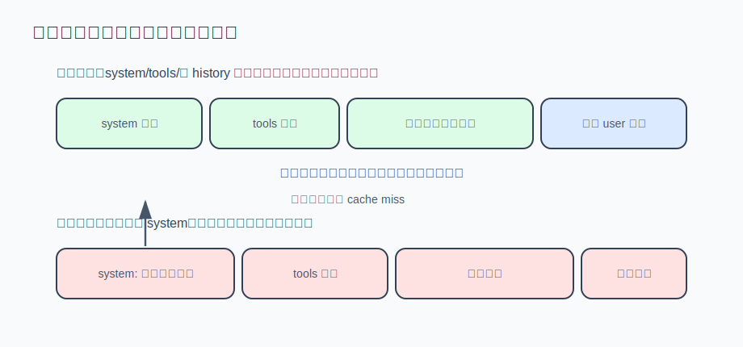

# s07 · Prompt 缓存

跑一个 30 轮的任务，账单会吓你一跳：agent 每轮都把越来越长的对话历史全量重发，第 1 轮发 2k token，第 30 轮就是 100k，累计发送的输入是历史长度的几十倍——花钱大头全在输入侧。服务商为此提供了**前缀缓存**：这次请求的开头和上次逐字节相同的部分，单价降到约十分之一。本章讲怎么保持开头稳定以命中缓存，以及怎么测量命中率。

原理：模型收到请求后要把整个 prompt 从头算一遍（prefill，占输入侧几乎全部算力）；开头和上次相同时，中间结果（KV cache）可直接复用，几乎不花算力。第 30 轮请求里前 99% 与上一轮相同——命中打一折，不命中全价。以 30 轮、每轮 60k、累计输入 1.8M token 为例：

- 全部未命中：1.8M × 全价；
- 稳定 95% 命中：1.8M × (5% × 全价 + 95% × 一折) ≈ 0.145 × 全价，省 85%。

功能相同的两个实现，账单可以差出近 7 倍——不命中的原因往往只是 system prompt 里的一行 `当前时间：...`。（DeepSeek/OpenAI 的缓存自动生效；Anthropic 要显式打 `cache_control` 断点，否则命中率恒为 0，计价见文末。）



本章代码 = s03 的最小 agent 循环 + 每轮打印 token 用量与缓存命中率（免 key 演示：字节级找出缓存断点）。

## 运行演示（不需要 API key）

```sh
node s07_prompt_cache/demo.mjs
```

## 设计：三条纪律，一套仪表

### ① 三条纪律：保持前缀逐字节稳定

请求的开头依次是 system prompt、tools（工具定义）、历史消息，三条纪律分别对应：

1. **system prompt 逐轮字节稳定**。时间戳、随机数、"剩余预算 7 轮"这类每轮会变的内容会破坏缓存——变化在最开头，之后的 tools + 全部历史都按全价重算。会变的信息挪到最后一条用户消息：尾部本来就是新字节。
2. **tools 数组顺序稳定**。工具定义和 system 一起序列化在请求最前部。不要运行时排序、按条件增删、往 description 里拼动态内容。
3. **messages 只追加，不改写**（append-only）。任何一个字节被改动，缓存就断在那里，之后全部退回全价。常见错误是好心截短旧的工具输出——省几十 token，赔掉整段后续缓存（demo 实验 C）。

免 key 演示会直接算出断点位置（真实运行输出）：

```
━━━ 实验 A：时间戳写进 system ━━━
  第 2↔3 轮：公共前缀 21 字符（上一轮请求共 594 字符 → 可复用 3.5%）
    断点上下文: …"em]\n当前时间：10:23:02。你是一个运行在用户终" vs …"em]\n当前时间：10:23:03。你是一个运行在用户终"

━━━ 实验 B：system 稳定，时间戳放进用户消息尾部 ━━━
  第 2↔3 轮：公共前缀 597 字符（上一轮请求共 597 字符 → 可复用 100.0%）
    断点在上一轮请求的末尾之后——新增的只有追加的消息，这就是理想形状。

━━━ 实验 C：第 3 轮"好心"截短旧的工具输出 ━━━
  第 2↔3 轮：公共前缀 353 字符（上一轮请求共 597 字符 → 可复用 59.1%）
```

这三条纪律难的不是做到，而是在后续迭代中不被悄悄破坏——**缓存击穿是静默的**，没有报错，只体现在账单上。真实产品用回归测试守住它，见文末。

### ② 测量：读取 usage 里的命中数据

不打印命中率，就无法验证纪律是否生效。服务商在 `usage`（响应附带的用量字段）里报了账，但字段名不统一：

```js
// DeepSeek：usage.prompt_cache_hit_tokens / usage.prompt_cache_miss_tokens
// OpenAI：  usage.prompt_tokens_details.cached_tokens（未命中 = prompt - cached）
let hit;
if (typeof usage.prompt_cache_hit_tokens === "number") hit = usage.prompt_cache_hit_tokens;
else if (typeof usage.prompt_tokens_details?.cached_tokens === "number") hit = usage.prompt_tokens_details.cached_tokens;
```

本章 agent 每轮打印一行统计（格式示意；第一轮命中 0% 正常——要有上一次请求才有可复用前缀）：

```
📊 prompt 48213 | 命中 47616（98.8%）| 未命中 597 | 本轮输入费≈省 89% | 会话累计命中 91.2%
```

健康的 agent 从第二轮起命中率应在 90% 以上，且随任务变长越来越高。异常时对照下表排查：

| 现场 | 诊断 |
|---|---|
| 每一轮都是 0% | 前缀在最开头就断了——system 或 tools 里混进了每轮变化的字节（时间戳最常见） |
| 一直 95%+，某轮突然跌到 50% | 历史中段被改写了——检查是否有代码在回头修剪旧消息（违反 append-only） |
| 压缩后的第一轮跌到接近 0% | 预期行为：s06 把历史整段重写，缓存必然失效一次（system + tools 那一小段还能命中），用一次全价换之后每轮更短的前缀 |
| 命中率正常但账单没降 | 确认服务商确实支持前缀缓存并读对了字段——读不到字段时本章 agent 会明确提示，而不是打印一个假的 0 |

往尾部追加的机制天然无害（如 s03 看门狗的纠偏消息），危险的只有回头改写。

## 运行方式

```sh
AGENT_API_KEY=sk-xxx node s07_prompt_cache/agent.mjs
```

给它一个多轮任务（比如"看看这个目录的结构，再读一下最大的那个文件"），观察每轮统计行：第一轮命中 0%，之后应迅速升到 90%+。再做对照实验：把 `SYSTEM` 第一行改成 `` `当前时间：${new Date().toISOString()}` ``，重跑同样的任务——命中率归零，直接看到这笔差价。

## 真实产品对照（延伸阅读）

**计价细节**：DeepSeek 的缓存命中输入价约为未命中的 1/10；Anthropic 的 cache read 同样是基础输入价的 0.1 倍，但缓存不自动生效——要在请求里显式打 `cache_control` 断点，且缓存写入按 1.25 倍计价。只学本章三条纪律、直连 Anthropic 而不打断点，命中率会一直是 0。

**用回归测试守住前缀稳定**：Reina（本系列对照的生产级 agent）为此写了 `packages/core/src/engine-prompt.cache-stability.test.ts`：把所有每轮会变的状态（todos、计划、笔记、autopilot 进度、记忆块）全部填满，断言 system prompt 一个字节都不变——

```ts
const empty = buildSystemPrompt(baseSession());
const loaded = buildSystemPrompt(withVolatileState(baseSession()));
expect(loaded).toBe(empty);
```

这些易变状态走另一条通道 `buildVolatileContextReminder`，作为尾部消息随每轮追加（正是纪律①的"挪到最后"）。测试注释说明了它存在的意义：某天有人把一个每轮会变的值接进 buildSystemPrompt 时，让测试显式失败。

**案例：摘要调用复用主 agent 的缓存前缀**。s06 的压缩要把整段被压历史发给摘要模型——看起来注定全价：换了 system prompt（摘要指令）、不带 tools，前缀从第一个字节就对不上。一次压缩 = 10 万 token 全价。Reina 的解法（`packages/core/src/compaction.ts`，搜 `SummaryCacheReuse`）：摘要调用**不换 system**。直接复用主 agent 刚缓存过的 `[system + tools + history]` 前缀——被压缩的大段历史按原样作为消息发出（provider 序列化和上一轮逐字节相同），摘要指令作为追加的一条用户消息放在末尾。于是 10 万 token 的历史按缓存读计费，全价的只有末尾几百 token 的指令。代价是一点风险：主 agent 的 system prompt 鼓励用工具，模型可能不做总结而去调工具——所以指令里带上"禁止调用工具"的围栏，一旦模型仍去调工具，立刻放弃、退回换 system 的常规路径重试。最坏情况多花一次几乎全命中的调用，不会拿到降质的摘要。

**案例：fork 子代理继承父会话的缓存**。多 agent 场景的痛点是冷启动：每个子代理独立的 system + 历史，第一轮全价。Reina 的 fork 模式（`packages/core/src/subagent/fork.ts` 的 `buildForkContext`，由 `subagent/manager.ts` 调用）让子代理直接继承父会话的消息尾部（按 token 预算选，默认 8k、上限 24 条，且刻意停在消息边界上）——子代理的第一轮请求就是"父会话的前缀 + 一条任务指令"，第一轮即可命中父缓存。源码注释的说法：一次 fan-out 的成本是 "supervisor's prefix + small delta per worker"，而不是 N 次冷启动。子代理的完整机制在 s09 展开，这里先记住：**缓存友好是它的初始设计**，不是事后补丁。

**Claude Code 的实例**：它同样遵守这套纪律——system prompt 会话内稳定，动态上下文（文件变更提醒、todo 状态）全部以 `<system-reminder>` 消息追加在对话尾部，而不是改写 system。transcript 里那些 reminder 的位置，就是纪律①的实例。

**粒度与序列化细节**：缓存匹配实际按 token 块粒度对齐（DeepSeek 64 token 一块，Anthropic/OpenAI 也有各自的最小长度和断点规则），demo 用字符近似只是为了让断点位置直观可见，原理一致。system 与 tools 在请求前部的先后顺序因服务商而异，Anthropic 是 tools 在前。

## 练习挑战

1. 给本章 agent 加一个 `/cost` 命令：按你所用服务商的真实价目（命中价、未命中价、输出价）把会话累计花费折算成钱，并对比"如果全部未命中"的假想账单。成本可见，纪律才可验证。
2. 思考题：s06 的压缩把历史整段重写，缓存必然失效一次。压缩的阈值（75%）和缓存之间存在一个权衡：压得越早，缓存失效越频繁；压得越晚，每轮承担的未命中风险越大。如果服务商的缓存保留时间很短（Anthropic 默认 TTL 只有 5 分钟；DeepSeek 是小时级的闲置淘汰），这个权衡又会怎么变？（s09 讲子代理时会再回到"前缀即资产"这个视角。）

---

| [← 上一章：上下文压缩](../s06_compaction/README.md) | [目录](../README.md) | [下一章：会话持久化与恢复 →](../s08_persistence/README.md) |
|---|---|---|
