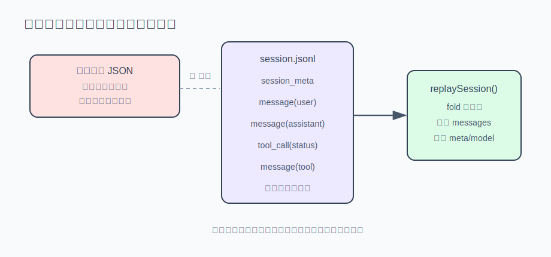

# s08 · 会话持久化与恢复

本章把会话写到磁盘，崩溃后原样恢复，做法是**追加式事件日志 + 重放**。

本章代码 = s03 的最小 agent 循环 + [store.mjs](./store.mjs)（事件日志与重放）。

## 问题

agent 干了半小时的活：几十轮对话、二十次工具调用。你按错了 Ctrl+C，或终端误关、笔记本没电——重新打开，它什么都不记得。前几章的 agent 都这样：`messages` 只存在内存里。

常见的第一反应是"存成 JSON 文件，每次变化整个重写"。这个方案有隐患——demo 场景一真实写磁盘、真实模拟崩溃，展示了这个现场：

```
━━━ 场景一：全量重写 JSON，崩溃在写到一半时 ━━━
  磁盘上留下 124/207 字节的 session.json，尝试恢复：
  ✗ JSON.parse 失败：Unterminated string in JSON at position 124 (line 7 column 27)
  ✗ 整个会话报废 —— 不止最后一条消息，之前的历史也一起没了。
```

## 解决方案

落盘的不是状态快照，而是事件：每发生一件事就往 JSONL 文件末尾追加一行，已写下的字节永远不被触碰；恢复时逐行重放事件，把 `messages` 重新推导出来。崩溃的影响从"整个文件可能写坏"缩小到"最后一行可能写了一半"——跳过那行即可：丢一条消息，不丢整个会话。



## 运行

免 key 演示：

```sh
node s08_persistence/demo.mjs
```

三个场景，全部真实写磁盘、真实模拟崩溃（场景一的输出见上文"问题"）。场景三的输出节选：

```
━━━ 场景三：崩溃把最后一行写了一半 ━━━
  往同一个 .jsonl 追加了半行（49/98 字节），再次重放：
  ✓ 恢复出 4 条消息，跳过 1 行损坏数据
  ✓ 只丢了崩溃瞬间那一条，之前的全部历史完好。
```

接上真实模型，启动时分岔：带 `--resume <id>` 就重放恢复，否则开新会话并打印 id：

```sh
AGENT_API_KEY=sk-xxx node agent.mjs
# 新会话 ses_mr47xdu8_sgf8（落盘于 …/.sessions/ses_mr47xdu8_sgf8.jsonl）
# 下次续上：node agent.mjs --resume ses_mr47xdu8_sgf8

AGENT_API_KEY=sk-xxx node agent.mjs --resume ses_mr47xdu8_sgf8
# 已恢复会话 ses_mr47xdu8_sgf8：14 条消息，5 次工具调用
```

验收：跟它聊两轮、让它读个文件，Ctrl+C 退出，再 `--resume` 回来问"刚才聊到哪了"——它应该答得上来。s03 看门狗注入的纠偏消息也走 `pushMessage`（见下文"实现"）：恢复出的会话必须和退出前一致。

## 实现

### ① 为什么"每次全量重写 JSON"不可靠

写文件不是原子操作。`writeFileSync(f, bigJson)` 在操作系统层面是"打开（清空旧内容）→ 分块写入字节"。崩溃落在中间，磁盘上就是半个 JSON：旧版本已清空，新版本没写完——`JSON.parse` 失败，整个会话（包括崩溃前完好的部分）一起丢失。演示场景一就是这个现场。

而且越用越危险：会话越长，重写窗口越大，中招概率越高——最有价值的长会话恰恰最容易被写坏。

追加式日志（JSONL：一行一个 JSON）从结构上消除了这个问题：

```
{"ts":"…","type":"session_meta","meta":{"id":"ses_x","model":"deepseek-chat",…}}
{"ts":"…","type":"message","message":{"role":"user","content":"帮我修一下登录页"}}
{"ts":"…","type":"tool_call","record":{"id":"call_1","name":"read_file","status":"completed",…}}
```

每发生一件事（用户消息/助手消息/工具结果/压缩边界）就在末尾追加一行，**已写下的字节永远不被触碰**。崩溃的影响被限制在"最后一行可能写了一半"——恢复时跳过那行即可：丢一条消息，不丢整个会话。这不是额外的容错，是"只追加"结构自带的性质。

### ② 恢复 = 重放：状态是事件流的推导结果

落盘的是事件，不是状态。恢复时逐行读事件，把 `messages` 数组重新推导出来：

```js
for (const line of text.split("\n")) {
  if (!line.trim()) continue; // 文件末尾的换行会产生空串，先跳过
  let event;
  try { event = JSON.parse(line); } catch { skipped++; continue; } // 半截行：跳过
  switch (event.type) {
    case "session_meta": meta = event.meta; break;
    case "message":      messages.push(event.message); break;
    case "tool_call":    /* 按 id upsert 进 toolCalls */ break;
    default: break; // 未知类型忽略 —— 老代码也能加载新版本写的日志
  }
}
```

这个结构带来两个不显眼但重要的自由度：坏行可以跳过（容错）；未知事件类型可以忽略（**向前兼容**——新版本程序写的日志，旧程序照样能加载它认识的部分）。

### ③ 会话粒度的配置也在流里

恢复会话时，模型配置从哪来？很多实现顺手用当前的环境变量或全局默认。这是错的：**用什么模型是这个会话自己的属性**，创建时就冻结进第一行 `session_meta`，恢复时以它为准：

```js
meta = createSession(SESSIONS_DIR, { model: process.env.AGENT_MODEL ?? "deepseek-chat" });
// ……第二天恢复时：
const MODEL = restored.meta.model; // 来自会话记录，不是今天的默认值
```

配置跟着会话走，界面显示和实际请求才不会不一致（真实产品踩过事故，见文末）。

### ④ 工具调用带结构化 status 落盘

s03 有个临时方案：靠报错文案的开头文字（`FAILURE_RE`）判断工具调用是否成功。文案是写给模型看的，随时会改——拿它当机器判据太脆。本章移除这个脚手架：**成败在执行那一刻确定，作为结构化字段落盘**。

约定很简单：handler `return` = completed，`throw` = failed；报错文案原样回给模型（错误即信息），但"失败了"这个事实走字段：

```js
try {
  return { status: "completed", output: tool.handler(args) };
} catch (err) {
  return { status: "failed", output: err.message };
}
```

落盘的 `tool_call` 事件带着这个 status。从此审计、重放、监督逻辑都读字段，不再解析文案。

### 接进你的 agent

[agent.mjs](./agent.mjs) 是 s03 的 agent + 落盘。关键改动两处。第一，消息只从一个入口进数组——内存和磁盘一步完成：

```js
function pushMessage(message) {
  messages.push(message);
  appendEvent(SESSIONS_DIR, meta.id, { type: "message", message });
}
```

第二，启动时分岔：带 `--resume <id>` 就重放恢复，否则开新会话并打印 id（运行命令见上文"运行"）。

## 练习

1. 给 `store.mjs` 加一个 `compacted` 事件和对应的重放逻辑：记录"从第 N 条消息之前已被压缩为摘要 S"，重放时用摘要替换被压缩的区间。s06 的压缩机制落盘之后，才算完整闭环。
2. 思考题：demo 场景三里半截行恰好在文件末尾，跳过它显然安全。但如果坏行出现在文件中间（比如磁盘坏块），跳过一条 `message` 可能让后面的 `tool` 消息变成"孤儿"（tool_call_id 对不上助手消息）——API 会拒绝这样的序列。恢复时该怎么检测并修剪这种断链？（提示：s05 处理 Ctrl+C 留下的残缺消息序列用的是同一套办法。）

## 与真实产品对照（延伸阅读）

本章机制对应 Reina（本系列对照的生产级 agent）的 `packages/core/src/rollout.ts`（参照 openai/codex 的 rollout recorder 建模）：每个会话一个 `.reina/sessions/<id>.jsonl`，每次状态变化 append 一行 `{ ts, type, ... }`。示例版三种事件类型，生产版二十多种（`message` / `tool_call` / `tool_update` / `compacted` / `usage` / `todos`……）。几个值得参考的生产细节：

- **不变量写在注释里**："Writes are `O_APPEND` only. No code path ever rewrites an existing byte"——跨进程的并发写者也无法互相覆盖历史。进程内则常驻一个文件句柄、用 Promise 链串行化所有 append（示例版每次重开文件，崩溃安全性一样，性能差一些）。
- **重放跳过坏行**：`loadRolloutAsSession` 对每行单独 `JSON.parse`，失败（"likely a torn final write from a crash"）就跳过并告警 `skipped N malformed line(s)`——和本章 demo 场景三相同。
- **工具调用是结构化记录**：`packages/protocol/src/index.ts` 的 `ToolCallRecord` 带 `status: "pending_approval" | "running" | "completed" | "rejected" | "failed"`——比示例版的两态多出审批流和运行中；还有 `outputPath` 指向 `.reina/tool_outputs/` 下的完整输出存档。
- **决定③的真实事故**：Reina 曾在加载旧会话时，模型选择器显示新会话的默认值，而不是会话真正在用的（重放恢复出来的）模型——一个绑定了订阅的会话看起来像在用普通 API key，请求 401，用户以为是配置错误，排查了很久。**模型配置随会话重放**之外，还有一个细节：`config` 事件对 model 是整体替换而非浅合并——浅合并会让上一个模型的 `baseUrl` 泄漏到切换后的模型上，Reina 注释里记着一次真实事故：kimi 切 codex 后残留的 baseUrl 把请求路由到了错误的主机。
- 仅有的"全量重写"出现在迁移旧格式时（`migrateJsonSnapshotToJsonl`），而且写法是先写临时文件再 `rename` 进位——rename 在同一文件系统上是原子的，崩溃也不会留下半个 jsonl。

另一个可观察的例子：Claude Code 的会话也是 JSONL（`~/.claude/projects/<项目>/**.jsonl`），`--resume` 的底层就是同一套重放事件流。

---

| [← 上一章：Prompt 缓存](../s07_prompt_cache/README.md) | [目录](../README.md) | [下一章：子代理与看门狗 →](../s09_subagent_watchdog/README.md) |
|---|---|---|
