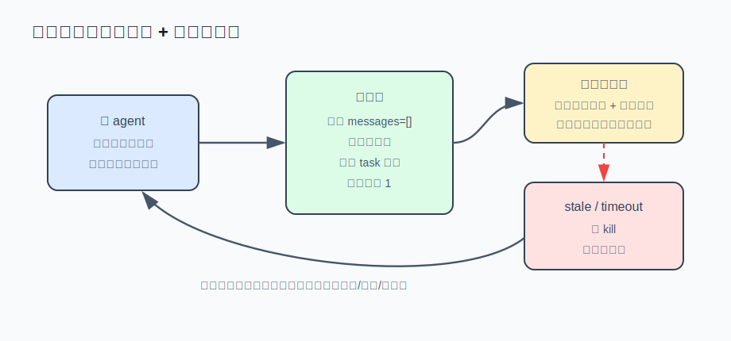

# s09 · 子代理与看门狗

让 agent「找出 Auth 模块的所有引用」，它可能要 grep、读文件、再 grep 跑上二十轮。结论只有几行，几十万 token 的中间输出却全留在主对话里：之后每轮都为它们付费，还稀释模型的注意力。而且活派出去后可能悄悄卡死——工具 hang 住、模型流断开——只能干等。

本章的解法：用**子代理**（一个有独立对话历史的迷你 agent）把探索隔离在主对话外，只带结论回来；再用循环外的**心跳看门狗**（定时检查「最近有没有动静」）检测卡死，中止前还让它把已完成的工作总结带走。



本章代码 = s03 基底 + `subagent.mjs`（task 工具 + 心跳看门狗）。

## 运行演示（不需要 API key）

```sh
node s09_subagent_watchdog/demo.mjs
```

演示包含四个事件流可脚本化的假子代理，分别走向四种结局。输出节选：

```
━━━ 场景二：闲置卡死被抓 ━━━
  🔴 看门狗击杀（stale，已闲置 423ms）
  结局：disposition=stale，耗时 624ms，延期 0 次

  ↳ 击杀不是终点：给它一个遗言回合…
  遗言（disposition=completed）：1) 原任务：定位 Auth 引用；2) 已确认 src/login.js、src/api.js 两处；3) 还差测试目录没搜。

━━━ 场景四：硬顶到点但还活着，获得延长 ━━━
  🟢 硬顶到点，但最近 200ms 内有事件 → 延长 600ms（第 1 次）
  结局：disposition=completed，耗时 2415ms，延期 1 次
```

## 五个设计决定

### ① 子代理是全新对话的迷你主循环，深度上限 1

`createChild()` 的核心是这一行：

```js
const messages = []; // 上下文隔离的关键：一个全新的空数组
```

子代理复用主 agent 的同一套 chat + dispatch + LoopBudget，只有三处不同：自己的空 messages；自己的 system prompt（「你没有用户可以提问，最后一条回复就是交付物，把结论写全」）；工具箱里没有 task。最后一点是防递归的深度上限：想再派子代理，工具不存在。没有它，弱模型会派生一棵子代理树，成本指数增长。

### ② 心跳：活着的标志是「最近产生过事件」

子代理每产生一个事件（模型回复、工具完成）就刷新 `lastEventAt`；看门狗每 10 秒（生产值）看一眼距上次事件多久了。

```js
const idleMs = Date.now() - lastEventAt;
const limit = child.isInTool() ? limits.staleInToolMs : limits.staleIdleMs;
if (idleMs > limit) { disposition = "stale"; child.interrupt(); }
```

超时预算分**两档**：闲置（没在跑工具也没有事件）450 秒判卡死；工具运行中放宽到 1200 秒——跑一遍测试、装一次依赖，沉默十几分钟很正常，一刀切会误杀。demo 场景三就是对照：工具中沉默 1200ms 远超闲置预算 400ms，但没有被杀。（示例的工具是同步执行的，这一档实际不生效，见文末对照。）

### ③ 总时长硬顶与活性延期：到点先检查，再决定是否中止

只有卡死检测不够——每 9 秒挤一个 token 的子代理永远不算卡死，却能无限运行。所以还有总时长上限（生产值 600 秒）。到点直接中止会误杀正在收尾的，所以**到点先检查活性**：

```js
setTimeout(() => {
  if (Date.now() - lastEventAt < limits.healthyRecentMs) { // 最近 30 秒内有事件？
    timer = scheduleTimeout(limits.healthyExtendMs);       // 还活着 → 延长 300 秒再看
    return;
  }
  disposition = "timeout";
  child.interrupt();
}, delay);
```

延长不是无限的：延期后不再动的，卡死检测仍会抓到；继续工作的，下次到点再查。这是 s03「软预算 + 硬顶」的时间版本。

### ④ 中止前抢救结论：遗言回合

被中止的子代理可能已经做完大半，直接丢弃等于白花钱。所以中止后解除中断标志，给它一个简短的「遗言」回合（这个回合也有小超时），prompt 问三个问题：

```
1. 原任务是什么？
2. 你完成了哪些具体步骤（碰过的文件、确认过的事实、验证过的假设）？
3. 还差什么没做完？下一步合理的做法是什么？
```

遗言拼进 task 的失败结果带回主 agent，下次重派不必从零开始。prompt 里必须写明「不要再调用工具、只描述和建议」：否则被唤醒的子代理会继续执行原任务，再被中止一次。

### ⑤ 相同任务不重复派发

弱模型有时在同一条回复里连发两个一模一样的 task。第二个必然多余——第一个的结果还没返回，重发没有依据。派发前把任务说明（brief）归一化（压空格、转小写）再比对：同批已有相同任务，直接复用它的结论，不再开新子代理。

## 接进你的 agent

[agent.mjs](./agent.mjs) 里 task 的 handler 就是这五件事的串联。看门狗**套在子代理外面**，子代理对此不感知：

```js
const { disposition, result, durationMs } = await runChildWithWatchdog(adapter, PROD_LIMITS);
if (disposition === "completed") return result;
child.resetForConclude(); // 中止后：解除中断，进遗言回合
const conclude = await runChildWithWatchdog(
  { ...adapter, run: () => child.runTurn(concludePrompt(disposition, durationMs)) },
  { ...PROD_LIMITS, timeoutMs: PROD_LIMITS.concludeTimeoutMs },
);
```

验收：`AGENT_API_KEY=sk-xxx node agent.mjs`，让它「用子代理调查这个目录里有什么类型的文件」：子代理的工具调用逐条输出，最后只有一段结论回到主对话。

## 真实产品对照（延伸阅读）

先补几个正文略过的细节。事件的粒度：示例按「模型回复、工具调用完成」记事件，真实产品按流式 token 更新，粒度更细。`chat()` 增加了 `signal` 参数，`child.interrupt()` 会 abort 在途的 fetch——模型流中途断开也能中止，这正是心跳看门狗要处理的一类卡死。子代理的 LoopBudget 熔断（s03 的轮数硬顶触发强制停止）时不做纠偏，直接结束回合把控制权交回主循环——在隔离上下文里继续消耗，不如让监督者换个 brief 重派。⑤的归一化意味着 `"查一下  Auth"` 和 `"查一下 auth"` 视为同一任务；去重命中时返回的是指向原任务的指针。

再展开②提到的局限：本章示例 agent 的工具全是同步的（`execSync`/`readFileSync`），工具执行期间 Node 的事件循环被阻塞，心跳定时器不会触发——「工具在途」这一档在示例 agent 里实际不生效，只有 demo 的异步假子代理能演示它。要让看门狗检测到工具中的卡死，工具必须改成异步 `spawn`（Reina 和 Claude Code 都是这么做的），让事件循环在工具执行期间保持运转。

本章机制对应 Reina 的 `packages/core/src/subagent/manager.ts`。生产常量（均可环境变量覆盖）：`MAX_SUBAGENT_DEPTH=1`、硬顶 `DEFAULT_SUBAGENT_TIMEOUT_MS=600_000`、心跳 `HEARTBEAT_INTERVAL_MS=10_000`、`STALE_IDLE_MS=450_000`、`STALE_IN_TOOL_MS=1_200_000`、活性窗口 `HEALTHY_RECENT_MS=30_000`、延期 `HEALTHY_EXTEND_MS=300_000`、遗言硬顶默认 90 秒。几个示例版没有覆盖的生产细节：

- 防递归是双保险：`assertDepth()` 显式检查深度之外，`BLOCKED_FOR_SUBAGENT` 集合直接把 `task`、`question`（子代理没有用户可问）、`compact_conversation` 等工具从子代理工具箱里移除——defense in depth。
- 等待用户不算卡死：子代理的工具在等用户审批（`pending_approval`）时，心跳和硬顶都暂停计时——用户离开电脑几小时是合法状态，等待的时间还会补回硬顶额度。
- 中止前先警告：闲置超过预算一半时先向 UI 发 `async-task-warning`，用户可以在中止前介入。
- 首轮宽限：还没有任何工具调用/轮次时按在途（宽）预算计算——较慢的首个模型响应不应被误杀。
- 去重覆盖两个窗口：`findLiveDuplicateDispatch` 管跨轮（同 (agent, brief) 的任务还在 running/resuming 就返回 merged 指针），`inFlightDispatches` 管同批并发。归一化和本章相同：压空格、转小写、截 240 字符。此外还有同 brief 失败重试上限（默认 3 次）：反复失败的 brief 会被直接拒绝——"re-firing the same prompt won't help"。
- 遗言产物的标注原文：`[Salvaged self-report — original task was killed; this is the subagent's summary of what it did before the cut-off]`——明确告诉监督者这不是正常交付。

Claude Code 的 Agent tool（子代理）同样是「结论带回、过程隔离」：主对话只能看到它的最终报告，中间几十轮搜索不进主对话——派一个搜索任务时观察 token 计数即可确认。

## 动手挑战

1. 把 task 改造成异步版：`start_task` 立刻返回 `task_id`，另加 `check_task` 工具查询进度/取结果（提示：`runChildWithWatchdog` 的调用改成 fire-and-forget，结果存进一个 Map）。做完后同 brief 去重会从「同批」扩展到「跨轮」——这是 s11 多 agent 协作的基础。
2. 思考题：本章的 `interrupt()` 是协作式的——abort 在途 fetch、在轮次边界停下。但如果卡死的是 `execSync` 里的子进程（30 秒超时之前），中断要等它自然超时才生效。真正的强制终止需要什么？（提示：想想为什么 Reina 的子代理是独立的 engine 实例、Claude Code 的工具跑在可以 `kill()` 的子进程里。代价是什么？）

---

| [← 上一章：会话持久化与恢复](../s08_persistence/README.md) | [目录](../README.md) | [下一章：System prompt 组装 →](../s10_prompt_assembly/README.md) |
|---|---|---|
