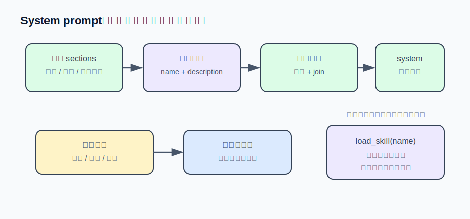

# s10 · System prompt 组装

本章代码 = s03 基底 + prompt 分段拼装（`prompt.mjs`）+ skills 目录 + `load_skill` 工具。

## 问题

你在 system prompt 里加了一行「当前时间：14:23:07」，账单随后涨了好几倍。原因是**前缀缓存**：主流 API 会把请求开头与上次逐字节相同的部分缓存起来，命中只收约一折的费用——而时间戳每轮都变，整个前缀每轮全额重付。另一个膨胀源是知识：把「提交规范」「审查清单」这类团队约定全文塞进 system prompt，几十个知识块每轮都在收费，真正相关的内容反而被淹没。

## 解决方案

本章两个解法：system prompt 按固定顺序分段拼装、段内不放会变的值，保证字节稳定；领域知识做成「技能」，只把目录（每个技能一行名字和适用场景）放进 prompt，正文用工具按需加载。



## 运行

运行演示不需要 API key：

```sh
node s10_prompt_assembly/demo.mjs
```

输出节选（真实运行）：

```
━━━ 场景一：扫描 skills/，拼出目录 section ━━━

## 技能（只有目录，正文按需加载）
下面每行是一个技能的名字和适用场景。当任务和描述匹配时，先调用 load_skill("名字") 读取完整指引再动手……
- code-review-checklist: 审查代码改动（review diff / PR）时使用——按固定清单过正确性、边界、错误处理和测试盲区……
- git-commit-convention: 写 git 提交信息、整理提交历史时使用——Conventional Commits 的格式、类型选择和拆分原则。

对比：2 个技能的正文共 2797 字节，一个都没进 prompt —— 目录只花了 570 字节。

━━━ 场景二：确定性拼装 vs 塞时间戳的错误示范 ━━━

正确拼装：重扫磁盘 + 重新拼装，两次结果逐字节一致 ✅ → 前缀缓存命中
错误示范：把"当前时间"塞进 system，两次结果不一致 ❌ → 每轮整个前缀全部 cache miss

━━━ 场景三：运行中新增一个技能，重扫即出现 ━━━

第 1 轮扫描：code-review-checklist、git-commit-convention
第 2 轮扫描：code-review-checklist、git-commit-convention、release-checklist
引擎一行代码没改 —— 每轮开工前重扫目录，新技能下一轮自动可见。
```

## 实现

机制落在三个设计决定上。

### ① 分段拼装，确定性优先

拼装函数本身很短：

```js
export function buildSystemPrompt(sections) {
  return sections.filter(Boolean).join("\n\n");
}
```

机制全在调用约定里：段的顺序固定（越不容易变的越靠前）；段内容不含本轮才变的值（没有时间戳、没有轮数、没有任务进度）；空段被 `filter(Boolean)` 移除。只要输入不变，输出就逐字节一致。变化不是被禁止，而是被归位：技能目录变了，付一次缓存未命中，是应付的成本；什么都没变，就一个字节都不变。技能扫描结果也按名字排序——文件系统列目录的顺序不可依赖，两台机器可能扫出不同顺序。

真正易变的信息（当前时间）放在哪？附在最新一条用户消息尾部：

```js
function withVolatileReminder(text) {
  return `${text}\n\n<环境提醒>当前时间：${new Date().toISOString()}</环境提醒>`;
}
```

关键在于：写进历史的旧提醒不再变化——它成了后续前缀里稳定的一部分。易变内容只要永远出现在序列末尾、不改前面的字节，缓存就是安全的。

### ② 目录进 prompt，正文按需取

每个技能是 `skills/<名字>/SKILL.md`：文件开头的元信息区（frontmatter）写 `name` 和 `description`，正文是完整指引。三层结构对应三个付费时机：

| 层 | 进哪里 | 什么时候付费 |
|---|---|---|
| name + description | system prompt 的目录 section，每技能一行 | 每轮（~30 token/技能） |
| 正文 | `load_skill("名字")` 的工具返回值 | 模型判断相关时才付一次 |
| 附属文件（脚本、模板） | 正文里引用路径，agent 用 read_file 再取 | 更少 |

这正是 Claude Code skills 的机制——安装的每个 skill 也只有描述常驻上下文，正文触发时才加载。设计重心因此落在 **description** 上：「git 提交规范」五个字不够——模型不知道什么时候该看它；「写 git 提交信息、整理提交历史时使用——Conventional Commits 的格式、类型选择和拆分原则」才能让模型在合适的时机想起它。

### ③ 每轮重扫：技能是磁盘的函数，不是会话状态

技能目录在每轮开工前重扫：

```js
async function runTurn(messages) {
  const system = assembleSystemPrompt(loadSkills(SKILLS_DIR)); // 每轮重扫 + 重拼
  ...
}
```

技能的原始数据在磁盘上，会话里不留副本，每轮从源头重新推导。于是会话中途新增一个 SKILL.md（用户手动加，或 agent 自己用 write_file 写），下一轮自动出现在目录里，引擎零改动。

注意拼装在一轮内只做一次：一轮里模型可能连续调用十几次工具，这些请求的 system 必须逐字节一致，所以 `system` 在 `runTurn` 开头算好、整轮复用。

### 接进你的 agent

[agent.mjs](./agent.mjs) 相对 s03 基底的变化只有三处：`SYSTEM` 常量换成 `assembleSystemPrompt(loadSkills(...))`（每轮开工时拼装）；注册表新增 `load_skill` 工具；用户输入经 `withVolatileReminder` 附上时间再入队。主循环和看门狗没有改动。

`load_skill` 的失败路径依然遵循「错误即信息」：

```js
if (!skill) {
  const available = skills.map((s) => s.name).join("、") || "（无）";
  return `未找到技能"${name}"。可用技能：${available}。请使用目录中列出的确切名字。`;
}
```

有 key 的话运行 `AGENT_API_KEY=sk-xxx node s10_prompt_assembly/agent.mjs`，输入「帮我把这次改动提交了」，观察模型先 `load_skill git-commit-convention` 再写提交信息。

## 练习

1. 给 SKILL.md 的 frontmatter 加 `allowed-tools: read_file run_shell` 字段（Reina 就有）：`load_skill` 返回正文时把它渲染成一行约束提示。思考一个问题——这个约束对模型是「提示」还是「强制」？要做强制，检查应该放在哪一层（提示词？dispatch？）？
2. 把「用户规则文件」做成一个新 section：从 cwd 逐级向上收集每个 `AGENTS.md`，根目录的在前、最近的在后（就近覆盖）。文件不小且每轮都读，怎么避免重复 IO 又不错过用户的实时编辑？（提示：mtime；Reina 的 `formatUserRulesPrompt` 用 mtime 数组做缓存键。）

## 与真实产品对照（延伸阅读）

先补一个正文略过的取舍：③选「每轮重读」而不是「会话开始时读一次然后缓存」，是因为缓存就得配一套失效通知机制；「每轮重读」配合「确定性拼装」直接获得热插拔——没变化时字节一致、缓存照常命中，变了就付一次应付的 miss。

Reina 的 `packages/core/src/engine-prompt.ts` 里，`buildSystemPrompt(session)` 就是一个 sections 数组 `.filter(Boolean).join("\n\n")`——身份、思考风格、profile、会话目标、技能目录、shell 环境、MCP 服务器名单、用户规则，顺序固定。源码注释直接写明契约："STABLE sections only——这里的内容必须在多轮之间字节一致，provider 的缓存前缀才真的命中"。所有每轮会变的状态（todos、计划、笔记索引、autopilot 轮数、MCP 连接状态）被整体移进 `buildVolatileContextReminder`，作为缓存前缀之外的 system-reminder 每轮单发。守护这条约定的回归测试是 `engine-prompt.cache-stability.test.ts`：一次性填满所有易变状态，断言 system prompt 一个字节都不变——用来在有人把易变值接进 buildSystemPrompt 时报错。

两个值得注意的边界处理：日期故意留在稳定前缀里（模型没有时间锚点会误判「最近」「最新」这类词），但只精确到天——一天内字节不变，跨天付一次 miss，是精度和缓存的折中。MCP 服务器名单在首次拼装时冻结成快照（`snapshotMcpServersIfNeeded`），中途服务器掉线也不改前缀字节，实际漂移由易变区的 reminder 单独提示。

技能侧，`packages/core/src/skills.ts` 的 `loadSkills` 扫全局 `~/.claude/skills/` 和工作区 `<cwd>/.claude/skills/`（同名时工作区覆盖全局），每技能一个 SKILL.md，frontmatter 解析 name / description / allowed-tools，单文件上限 1MB，结果按名字排序；`formatSkillsPrompt` 每技能只注入一行，注释明确写着 "progressive disclosure"（渐进式披露），正文靠 `read_skill` 工具（本章叫 `load_skill`，同一机制）。实践中写技能，相当一部分工作量就花在 description 上。而 `engine.ts` 的 `runTurn` 第一行就是 `await this.refreshContext()`——每轮从磁盘重载技能，这正是「agent 用工具给自己装技能、下一轮自动生效」能在 Reina 里零引擎改动成立的原因。

---

| [← 上一章：子代理与看门狗](../s09_subagent_watchdog/README.md) | [目录](../README.md) | [下一章：多 agent 协作 →](../s11_agent_team/README.md) |
|---|---|---|
