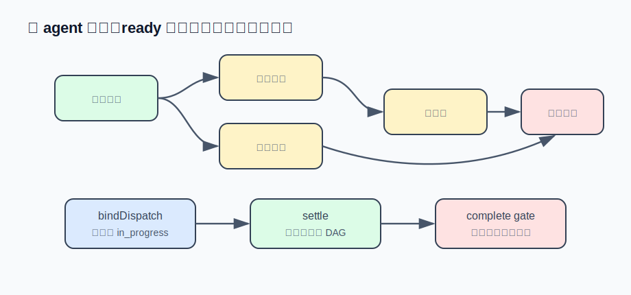

# s11 · 多 agent 协作

本章解决多 agent 协作中的协调问题：把「拆-派-收」的协调状态从协调者的上下文里搬出来，放进一个明确的数据结构——任务 DAG，由 ready 集合决定派谁、闸门决定何时收工。

本章代码免 key 优先：`dag.mjs`（任务图 + ready 集合 + 闸门）+ `demo.mjs`（假 worker 全流程演习）。真实接模型的版本只差一个参数，见「接进真实 agent」。

## 三类常见协调错误

给 agent 一个真实体量的任务：「把这个模块重构了，测试补上，文档也更新。」单 agent 串行做，慢是一方面，更大的问题是上下文膨胀——重构的几十轮工具观察还堆在窗口里，轮到写文档时已经在 s06 的压缩边缘反复触发。

s09 提供了子代理：把任务拆给多个子 agent 并行，各自的上下文互相隔离。但「拆-派-收」如果没有约束，协调者（负责拆分和派活的那个 agent）会以三种方式出错，每种都会出现在真实日志里：

| 事故 | 现场 | 根因 |
|---|---|---|
| 重复派活 | 两个子 agent 同时在重构同一个文件，改动互相覆盖 | 协调者不记得刚派过这个活 |
| 依赖没就绪就开工 | 「补测试」的子 agent 开工时重构还没完成，测的是旧代码 | 任务之间的先后关系只存在于协调者的上下文里 |
| 提前收工 | 测试还在失败，协调者宣布「全部完成」 | 「完成」由协调者自行判断，没有证据校验 |

三种事故的根因相同：**协调状态存在模型的上下文里**。上下文会被压缩（s06）、会被稀释、下一轮就可能丢失。本章把协调状态搬出来，放进一个明确的数据结构：任务 DAG。

这也是全篇反复出现的模式的又一次应用：s03 把「是否失控」从模型自觉变成看门狗计数，s09 把「是否卡死」变成心跳超时，本章把「能不能派 / 能不能收工」变成 ready 集合和闸门判定。重要的判定不交给模型自行评估。



## 运行演示（不需要 API key）

```sh
node s11_agent_team/demo.mjs
```

5 个带依赖的子任务 + 假 worker（随机耗时，「补测试」第一次必失败）。输出节选（真实运行，耗时略有随机）：

```
  [+0.3s]   ↳ 级联解锁：重构核心逻辑、更新文档 进入 ready 集合
  [+0.3s] ▶ 派发 sub_002「重构核心逻辑」→ w_008（第 1 次尝试）
  [+0.3s] ▶ 派发 sub_004「更新文档」→ w_009（第 1 次尝试）
  [+0.3s] 在飞 2/2，协调者手痒想再开一个顺手任务：
  [+0.3s] 🚫 并发已满（2/2），等一个在飞任务收口再派新活
  [+0.3s] 同一个 brief 再派一次（协调者忘了刚派过「更新文档」）：
  [+0.3s] 🚫 相同 brief 已在飞（w_009），合并等待它的结果，不再重复派
  ...
  [+1.0s] ❌ sub_003「补单元测试」失败：测试跑挂：3 个用例断言失败……
  [+1.0s] 「补单元测试」失败 → 下游「整体验收」保持 blocked。ready 集合：（空）

━━━ 第三幕：协调者急着宣布 complete ━━━

  [+1.0s] 🚧 拒绝进入 complete：还有 2 个子任务未收口 —— sub_003 [failed] 补单元测试；
          sub_005 [blocked] 整体验收。每个节点必须 completed 或明确 cancelled。
          要放弃整个任务请用 setPhase("failed")——那条路不设闸。
  [+1.0s] 被闸门点名后，协调者重派失败节点：
  [+1.0s] ▶ 派发 sub_003「补单元测试」→ w_00b（第 2 次尝试）
```

## 四个设计决定

### ① 任务图不是待办清单：blockedBy 边 + ready 集合

每个子任务带 `blockedBy: [...]`（依赖边）。DAG（有向无环图——边有方向、且沿边走不会绕回起点）替协调者回答了最容易答错的问题：现在能派什么？

```js
ready() {
  return this.list().filter(
    (n) => n.status === "pending" && n.blockedBy.every((d) => this.#byId.get(d).status === "completed"),
  );
}
```

协调者的每次派发都从 `ready()` 取，而不是自己推算依赖——「依赖没就绪就开工」从行为约束变成了**结构上不可能**。配套两个细节：级联解锁（节点收口时重查下游，依赖全部完成的自动从 blocked 变为 pending，不需要协调者轮询）；环检测（加边前从目标节点沿下游 DFS 一遍，模型把依赖写反时得到一条可执行的报错，而不是一个永远无人 ready 的死图）。

### ② 派活即绑定，收口即回写

三种事故里最隐蔽的是状态更新依赖自觉：协调者派了活「应该」把节点标成进行中，worker 干完了协调者「应该」把节点标成完成。任何一个「应该」被遗漏，DAG 就和现实脱节——典型情况是 worker 早已完成，节点永远停在 in_progress，下游永远不解锁，DAG 卡死。

解决办法是把两次状态更新都并入派发动作本身：

```js
const bind = dag.bindDispatch(node.id, grant.workerId);  // 派发瞬间：节点 → in_progress
// ...worker 干活...
dag.settle(node.id, { workerId, ok, summary });          // 收口瞬间：自动回写 + 级联解锁
```

绑定的那一刻节点就退出了 ready 集合——重复派同一个活在数据结构层面不可能。`settle` 还有一道**现任校验**：只有节点最新一次绑定的 worker 有资格回写。没有它，重试场景必然出错——第 1 次尝试超时、重派了第 2 次，然后第 1 次的迟到结果返回，把新尝试的状态覆盖掉。

### ③ 两道闸门：完成要有证据，翻篇要有交接

完备性闸门：宣布 `complete` 时逐个检查 DAG 节点，任何非终态（既没 completed 也没被明确 cancelled）都拒绝，并列出「还差哪几个」。关键是证据来源——**引擎手里的 DAG 状态**，而不是协调者的一句「我做完了」。模型的自我评估偏乐观（s03 里它每一轮都相信下次会成功），重要的判定要用外部状态做证据。闸门留了出口：`setPhase("failed")` 不设闸——放弃就明确放弃，而不是被闸门逼着谎报「完成」。

handoff 闸门：离开一个工作阶段（plan → exec）前，必须写一条本阶段新产生的交接记录（决定了什么/否决了什么/遗留什么）。旧阶段的交接不算数——基线在每次进入新阶段时重划，防止一份交接被复用两次。没有这道闸，阶段切换就只是标签变更，下一阶段的 worker 拿不到上一阶段的决策依据。

### ④ 并发上限 + 同 brief 去重

单个子代理失控消耗的是一个上下文的费用；协调者失控 spawn 消耗的是 N 倍。所以派发闸独立于 DAG 存在：并发满了拒绝新 spawn（提示「等一个在飞任务收口」），相同 brief 在飞时合并（提示「等它的结果」）。注意两种拒绝的 `reason` 是分开的——duplicate 应合并等待，capacity 应排队，处置完全不同，混成一个错误模型就无法自行纠正。这仍是 s02 的原则：报错是写给模型看的界面。

### 边界：什么时候不需要 LLM 协调者

如果任务的拆分和顺序是预先确定的——每晚跑 lint → test → build，谁依赖谁写死在配置里——不需要 LLM 协调者，一个确定性脚本调 N 个子 agent 就够了：更便宜、更可预测、出错可复现。LLM 协调者的价值在**拆分本身需要判断**的场景：任务边界要读了代码才知道、失败后该重试还是绕路要看失败原因、DAG 会随着新信息中途生长。判断题交给模型，判定题（依赖就绪了吗？全收口了吗？）交给数据结构——本章所有机制都在执行这条分界线。

## 接进真实 agent

免 key 演示里的「协调者」是脚本；真实版本里它是一个 agent，只需要在 s09 的基础上加一层：

1. DAG 操作做成工具：`create_subtask` / `update_subtask` / `get_dag` / `set_phase`，全部薄封装 `dag.mjs`，两道闸门的拒绝文案原样作为工具报错返回。
2. s09 的 `task` 工具加一个可选参数 `subtaskId`：dispatch 路径里带了它就先调 `dag.bindDispatch(subtaskId, taskId)`，子代理 settle 时自动 `dag.settle(...)`。绑定+回写是引擎行为，不依赖模型自觉。
3. 协调者的 system prompt 用 s10 的拼装方式注入一段团队指引：「先建 DAG 再派活；只从 get_dag 的 ready 里挑；派活必带 subtaskId；用 set_phase 推进阶段。」
4. s09 的心跳看门狗顺带闭环了最后一种失败模式：worker 物理卡死被中止后任务落 failed，经 settle 回写到 DAG 节点——协调者下一轮从 `get_dag` 里看到 failed 节点，决定重试还是取消。没有这条链路，一个 hang 住的 worker 就是一个永远 in_progress 的节点。

## 真实产品对照

本章机制对应 Reina 的 team 模式。`packages/core/src/subtasks.ts` 的 `SubtaskStore` 是生产版 TaskDag：blockedBy/blocks 双向边、`ready()`、终态级联解锁（`cascadeUnblock`）、加边前 DFS 防环；DAG 不单独落盘，每次变更记进会话 rollout 日志、加载时重放还原（s08 的持久化思路）。一个语义差异值得注意：示例版从严，失败节点阻塞下游；Reina 的 `computeReadiness` 让 failed/cancelled 的依赖**放行**下游——源码注释的理由是"协调者必须自己决断下游是否还成立，DAG 视图不能锁死"。从严便于教学，放行更实用。

绑定与回写在 `controllers/subtask.ts`：`start_async_task({ subtaskId })` 触发 `bindOnDispatch`（节点 in_progress + 记录 taskId，"drops out of the ready list and can't be double-dispatched"）；worker 收口时 `syncFromSettledTask` 把终态镜像回节点，且只认现任绑定——`node.asyncTaskIds.at(-1) !== task.id` 就直接忽略，正是②里的迟到结果问题。两道闸门同在此文件：`completenessGate` 拒绝 `set_phase("complete")` 时逐个列出未收口节点（`failed` 路线不设闸）；`handoffGate` 要求离开工作阶段（plan/prd/exec/verify/fix）前有一条新于本阶段入口的 `kind:handoff` 笔记，基线按笔记 id 而非时间戳记录。并发与去重在 `subagent/manager.ts`：默认同时最多 8 个异步子代理（`REINA_MAX_CONCURRENT_ASYNC_SUBAGENTS` 可覆盖），超了拒绝并提示先 `check_async_task`；同 agent + 同 brief 的重复派发不 spawn 新子代理，合并成指向原任务的指针观察。

Claude Code 侧也能观察到同样的纪律：它的 Agent 工具鼓励把相互独立的子任务放进同一条消息并行派发，而对已委派出去的搜索，指引明确写着"别自己再跑一遍、等结果"——同 brief 去重在提示词层面的表达。

## 动手挑战

1. 把示例版的「失败阻塞下游」改成 Reina 的「放行但标注」：`ready()` 对 failed/cancelled 依赖放行，但在返回的节点上附一个 `degradedDeps` 字段列出这些依赖。然后思考：协调者拿到这个字段后的三种合理处置分别是什么？
2. 给 `settle` 加第三道闸：worker 宣称 `ok: true` 但 `summary` 为空（或少于 20 字）时拒绝收口，要求 worker 提供「验收凭证」。对照完备性闸门思考——这道闸防的是哪一种自行判断？它和 s12 要做的「全链路验收」是什么关系？

---

| [← 上一章：System prompt 组装](../s10_prompt_assembly/README.md) | [目录](../README.md) | [下一章：完整 agent 整合 →](../s12_full_agent/README.md) |
|---|---|---|
