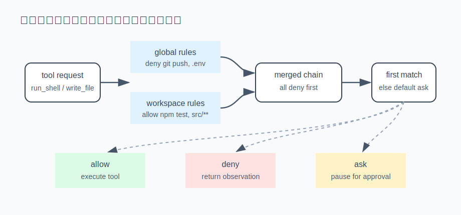

# s13 · 权限与审批

前面各章的 agent 具备 `run_shell`、`write_file` 等有副作用的工具，但没有任何约束：模型说 `git push`
就 push，说读 `.env` 就读。demo 里问题不大，放到真实项目里，误删文件、外泄密钥、误推生产分支
都可能发生。本章在工具执行之前加一层权限裁决，由一条**声明式、有序**的规则链决定放行、拒绝还是询问。



## 设计目标：自动裁决为主，必要时才询问

给危险操作加约束，有两个常见的极端：

- 什么都不问：全部放行，等于没有约束。
- 什么都问：每个工具调用都要用户确认。跑一次测试要点二十次"允许"，用户很快会习惯性放行，审批失去意义。

合理的做法在中间：大部分操作按预设规则自动裁决，只有规则未覆盖的才询问用户。问题于是变成
如何把裁决写成一套可预测、可复现的机制，而不是每次交给模型或用户临场判断。

方案是一条规则链，每条规则形如"什么工具 / 什么命令前缀 / 什么路径 → allow / deny / ask"，
从上到下**首匹配**。这延续了本系列的一贯原则（s03 看门狗、s11 闸门）：
重要的判定交给确定性的数据结构，不交给模型自由发挥。

## 运行演示（不需要 API key）

```sh
node s13_permissions/demo.mjs
```

一条全局规则链 + 7 个工具调用请求，观察首匹配如何裁决（真实运行输出）：

```
━━━ 场景 A：只有全局规则（首匹配 + 三态）━━━
  ✅ 放行    run_shell(git status)         命中规则 [allow "git status…"]
  🚫 硬拒   run_shell(git push origin main) 命中规则 [deny "git push…"]
  🚫 硬拒   run_shell(rm -rf node_modules)  命中规则 [deny "rm -rf…"]
  🚫 硬拒   read_file(.env.local)          命中规则 [deny **/.env*]
  ✅ 放行    read_file(src/engine.ts)       命中规则 [allow src/**]
  ❓ 问用户   run_shell(npm test)            无规则命中 → default
  ❓ 问用户   write_file(src/new.ts)         无规则命中 → default
```

## 设计：三个关键决定

### ① 三态裁决：allow / deny / ask

只有"允许/拒绝"两态是不够的——大量操作需要视情况而定，既不能默认放行也不该直接拒绝。
所以 verdict 有三态：命中 **`ask`** 时把决定权交还用户（弹一次审批），用户的选择还可以记住，
下次同类操作升级为 allow。没有 `ask` 这一档，就只能在过松和过紧之间二选一。

### ② 首匹配，顺序即优先级

规则链从上到下扫描，第一个命中的规则直接定案，后续规则不再参与。由此得到一个简单的
心智模型：危险的 `deny` 放最上面（`git push` / `rm -rf`），安全的 `allow` 放中间
（`git status` / 读 `src/**`），其余由链尾的 `default: "ask"` 兜底。

```js
export function evaluatePermission(rules, req, defaultVerdict = "ask") {
  for (const rule of rules) {
    if (ruleMatches(rule, req)) return { verdict: rule.verdict, rule };
  }
  return { verdict: defaultVerdict, rule: null };   // 不认识的操作，就问
}
```

一条规则可以给多个选择器（工具名 + 命令前缀 + 路径 glob），全部命中才算命中（AND）。
命令前缀匹配前需要先 `trimStart()`：模型偶尔会在命令前带一个空格，`" git push"` 不应
逃过 `git push` 的 deny。这类细节不处理，约束就有漏洞。

### ③ workspace 覆盖 global：deny 先于一切，allow/ask 才分层

同一套机制天然支持分层：全局规则（`~/.reina`，对所有项目生效）+ 项目规则（`.reina`，只对当前项目生效）。
直接把项目规则排在全局规则前面看似可行——首匹配会让项目规则自动覆盖全局。但这有一个漏洞：
项目里写一条 `allow: git push`，就能抢在全局 deny 前命中，项目配置因此解除了全局限制。
所以合并时 deny 要单独提到链首（不分层级），allow/ask 才按"workspace 在前"分层覆盖：

```js
export function mergeRules(globalRules, workspaceRules) {
  const isDeny = (r) => r.verdict === "deny";
  return [
    ...workspaceRules.filter(isDeny),   // deny 先于一切，谁写的都一样
    ...globalRules.filter(isDeny),
    ...workspaceRules.filter((r) => !isDeny(r)),   // 放行/问：项目覆盖全局
    ...globalRules.filter((r) => !isDeny(r)),
  ];
}
```

演示的场景 B 中，一个可信的 demo 项目预授权了 `npm test` 和写 `src/**`：

```
━━━ 场景 B：叠加 workspace 规则（项目里预授权，覆盖全局）━━━
  ✅ 放行    run_shell(npm test)            命中规则 [allow "npm test…"]   （被 workspace 提升）
  ✅ 放行    write_file(src/new.ts)         命中规则 [allow src/**]        （被 workspace 提升）
  🚫 硬拒   run_shell(git push origin main) 命中规则 [deny "git push…"]    （global 的 deny 仍在）
```

注意最后一条：项目能把 `npm test` 从"询问"提升到"放行"，却提升不了 `git push` 的 deny——
所有 deny 都合并在链首，workspace 即使写一条 `allow: git push` 也排在其后，永远不会命中。
**放权是加白名单，不是解除限制。** 项目配置可以减少可信项目的弹窗次数，但不能解除全局的
硬性拒绝，而且这一点要由合并顺序保证，不能依赖项目配置自觉遵守。

## 接进真实 agent

免 key 版是纯函数；接进 s01 的循环只需一层：派发工具之前先 `evaluatePermission`——
`allow` 直接执行；`deny` 回一条 observation 告诉模型"该操作被拒绝，请换一种方式"；
`ask` 则挂起循环、向用户发一个审批请求，拿到答复后再继续（复用 s05 的中断/恢复思路：
审批期间循环暂停）。危险操作的裁决因此总是发生在**副作用之前**。

## 真实产品对照

本章对应 Reina 的 `packages/core/src/permissions.ts`：`PermissionRule` 的形状、`evaluatePermission`
的首匹配、`ruleMatches` 里的 `commandPrefix` / `pathGlob` 选择器、一个自己实现的 `globMatches`
匹配器，以及"deny 先合并到链首，allow/ask 再由 workspace 覆盖 global"的覆盖语义，与本章一致。
生产版还多两件本章略过的事：规则文件按 mtime 缓存（避免每次求值都读盘），以及 shell 命令的审批走
`shell-approval.ts` 做更细的命令解析（把一行 `a && b` 拆成多条分别裁决，防止危险命令藏在
`&&` 后面）。三态里的 `ask` 对应桌面端弹出的审批卡片，用户点"总是允许"就把这条固化进
workspace 规则，即②③的组合。

Claude Code 的权限系统采用同样的思路：allow/deny/ask 三态 + 规则匹配（`~/.claude/settings.json`
里的 `permissions.allow` / `deny`，项目级 `.claude/settings.local.json` 叠加），并且同样是
deny 无条件优先于 allow——项目级配置能提升 allow，但不能覆盖任何一层的 deny，与本章 ③ 的
合并语义一致。

## 动手挑战

1. 给 `ask` 加"记住选择"：用户对 `run_shell(npm test)` 点了一次"总是允许"，就往 workspace 规则里
   追加一条 `allow`，下次同类请求不再询问。需要考虑记住的粒度是"这条命令"还是"这个前缀"：
   记太宽（`allow run_shell *`）等于解除限制，记太窄（整条命令逐字匹配）等于没记。
2. 本章的 `commandPrefix` 是纯前缀匹配，`git push` 能拦住 `git push origin main`，但能否拦住
   `git   push`（多个空格）或 `git push；rm -rf /`（拼接命令）？运行验证一下，再思考为什么
   Reina 要专门写一个 `shell-approval.ts` 把命令解析后逐段裁决，而不是简单比较前缀。

---

| [← 上一章：完整 agent 整合](../s12_full_agent/README.md) | [目录](../README.md) | [下一章：Provider 兼容层 →](../s14_provider_compat/README.md) |
|---|---|---|
