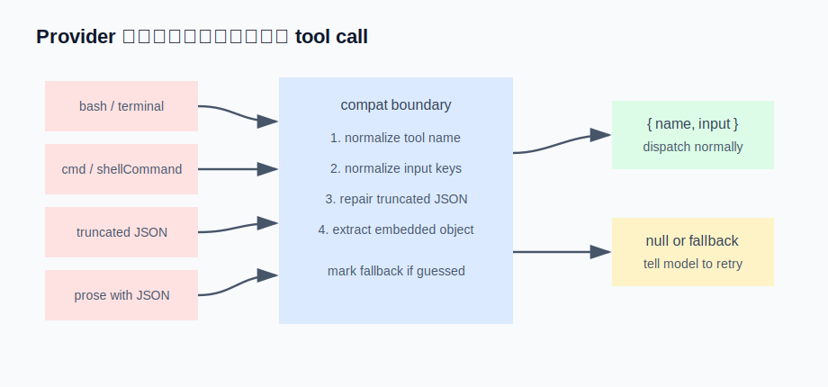

# s14 · Provider 兼容层

本章在模型和循环之间加一层整理，把各种不规范的工具调用在边界上统一成干净的 `{ name, input }`，循环对此毫无感知。

## 问题

把 agent 换到另一个模型（DeepSeek / Kimi / GLM / Qwen / 本地 Ollama），常见的第一反应是：它突然不会用工具了。明明定义的是 `run_shell`，模型喊 `bash`；参数 `command` 写成了 `cmd`；JSON 生成到一半被截断；甚至干脆把调用写进正文散文里。

理想情况下模型输出 `{"name":"run_shell","arguments":"{\"command\":\"ls\"}"}`。实际会遇到的情况：

| 问题 | 表现 |
|---|---|
| 名字写错 | `bash` / `shell` / `terminal`，指的都是你的 `run_shell` |
| 参数键写错 | `command` 写成 `cmd` / `shellCommand` / `script` |
| JSON 截断 | `max_tokens` 中途截断，`{"command":"npx vi` 就没了，引号括号都没闭合 |
| 写进正文 | 不走 tool 通道，在正文里写一段 ` ```json {...} ``` `，或混在解释文字中间 |

## 解决方案

放弃这些模型不是本地优先的选项。但这也不该是循环的负担——整理逻辑全部放在 provider 边界，而且全是确定性规则，不涉及模型。兼容层做四步处理：名字别名收敛、参数别名搬运、截断 JSON 修复、从正文提取对象；凡是靠修复/提取猜出来的结果，再做一个记号，让模型知道自己出了错、能自愈。



## 运行

演示不需要 API key：

```sh
node s14_provider_compat/demo.mjs
```

五种畸形输出的归一化过程（真实运行输出，节选）：

```
━━━ ② 参数键写歪：cmd / shellCommand → command ━━━
  模型吐出: name="run_shell"  args="{\"cmd\":\"npm test\",\"workdir\":\"/repo\"}"
  → 掰成: {"name":"run_shell","input":{"command":"npm test","cwd":"/repo"}}

━━━ ③ JSON 截断：max_tokens 砍在半路，引号括号都没关 ━━━
  模型吐出: name="run_shell"  args="{\"command\":\"npx vitest ru"
  → 掰成: {"name":"run_shell","input":{"command":"npx vitest ru"}}
  ⚠️  这是靠修复/抠取猜出来的（带 fallback 标记）。引擎照常执行，但会追一条提醒：
    「你的 JSON 没解析成功，我尽量补全了，下次请直接走工具调用」——让模型知道自己出了错、能自愈。

━━━ ⑤ 彻底解析不出：一堆散文，没有可用对象 ━━━
  → 掰不动。引擎收到 null，回模型一条 observation：
    「没识别出工具调用，请直接走 tool-call 通道并给出合法 JSON」
```

## 实现

### ① 名字别名表 + ② 参数别名表

两张对照表。名字表把 `bash → run_shell` 收敛；参数表列出每个规范键的常见别名，把值搬到规范键上。搬运只有一条纪律：**规范键已经有值就不动**——模型既填了 `command` 又填了 `cmd` 时，以 `command` 为准。

```js
for (const [canonical, aliases] of Object.entries(spec)) {
  if (out[canonical] != null) continue;         // 模型已经填对了，别动
  for (const alias of aliases) {
    if (out[alias] != null) { out[canonical] = out[alias]; delete out[alias]; break; }
  }
}
```

### ③ 截断 JSON 修复

被截断的 JSON 与其整条丢弃，不如确定性地补完整。扫一遍字符，记两个状态：括号开到第几层（一个栈）、当前是否在字符串里（注意 `\"` 转义不算字符串结束）。扫到末尾，还停在字符串里就补一个 `"`，再把没配平的 `{` `[` 倒序补成 `}` `]`，然后 `JSON.parse`。补不出就返回 null。

演示③里 `{"command":"npx vitest ru` 被补成 `{"command":"npx vitest ru"}`——命令可能缺了尾巴，但结构合法、可以执行，剩下的交给⑤。

### ④ 从正文里提取对象

有的模型不走工具通道，把调用写在正文里。先找 ` ```json ... ``` ` 代码围栏（格式最规整），找不到再找第一个配平的顶层 `{ ... }`（同样用括号计数 + 字符串状态，避免被字符串里的 `}` 骗到）。演示④就是从一整段中文解释里，把 `{"path":"src/config.ts"}` 精确抠出来。

### ⑤ 给猜出来的结果做记号

这是整层里最重要的一步。③④的结果都是**猜的**——修复和提取都可能出错。所以凡是不经正常 `JSON.parse` 成功、靠修复/提取得到的结果，都做一个记号（fallback 标记）。引擎看到记号照常执行，但追加一条提示："你的 JSON 没解析成功，我尽量补了，下次请直接走工具调用。"

没有这个记号，猜错的参数会静默执行——比直接报错更危险，因为没人知道它错了。有了记号，模型知道自己出了错，下一轮能自行纠正（s02 的原则：报错是写给模型看的 UI）。

### 接进真实 agent

在 s01 的循环里，模型返回后、派发工具前，插一步 `parseToolCall(rawName, rawArgs)`：拿到 `null` 就回"没识别出工具调用"让它重发；拿到结果就正常派发，带 fallback 记号的在工具结果后多附一条提醒。循环主体一行不改——所有兼容处理都封闭在这层适配器里。

## 练习

1. 给 `repairTruncatedJson` 喂几个更难的截断：`{"a":[1,2,` （数组没关）、`{"a":"b\` （末尾一个孤立反斜杠）、
   `{"a":{"b":` （嵌套一半）。哪些补对了？哪些补出了非法 JSON 返回 null？思考"补出一个看似合法但语义错的
   对象"和"直接返回 null"哪个危害更大——这决定了修复器应该多激进。
2. 现在 fallback 标记只用于提醒。改成分级：截断修复（③，多半只缺尾部）风险低，照常执行只提醒；
   从正文提取（④，可能提取错对象）风险高，改成走一次 `ask`（s13 的审批）让用户确认再执行。同一个标记，
   两种处置——如何给标记加上"不确定程度"这个维度？

## 与真实产品对照（延伸阅读）

本章对应 Reina 的 `packages/providers/src/tool-compat.ts`：`normalizeToolName` + `toolAliases` 管名字，`normalizeToolInput` / `pickFields` 管参数别名，`parseToolJson` 里的 `repairTruncatedJson`（补悬空字符串 + 逆序配平括号）和 `extractEmbeddedObject`（代码围栏 + 配平扫描）管残缺 JSON，推测结果的标记是一个 `WeakSet`（`wasJsonParseFallback`），与本章一一对应。相邻的 `tool-pairing.ts` 处理另一类问题：把流式输出的 tool_call 分片按 id 重新配对，拼回完整调用。

为什么值得单开一层？因为 Reina 的 provider 抽象要同时驱动 OpenAI 和 Anthropic 两套 API、底下又挂着十来个各家兼容后端。核心循环要保持 provider 中立，就必须把"这个后端 JSON 输出不规范"这类差异全部拦在边界上，不让它渗进引擎。Claude Code 也做类似的事——它对模型返回的 tool input 做校验和修复，schema 对不上时给模型结构化的报错让它重试，而不是直接失败。

---

| [← 上一章：权限与审批](../s13_permissions/README.md) | [目录](../README.md) | [下一章：渐进式工具披露 →](../s15_tool_disclosure/README.md) |
|---|---|---|
