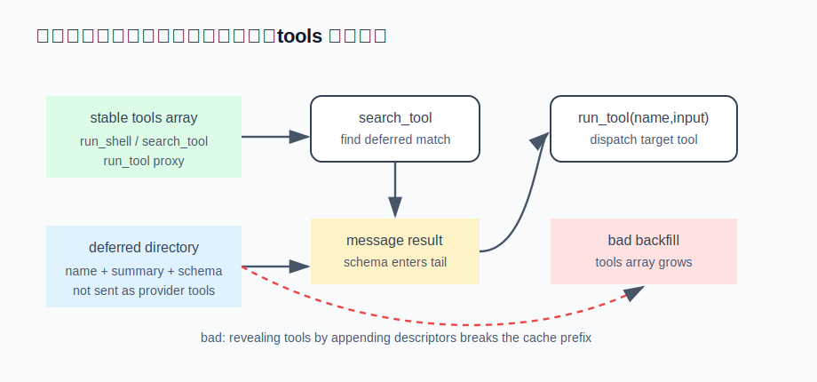

# s15 · 渐进式工具披露

本章是 s07（缓存命中工程）的延续，从 system prompt 前缀转到工具维度。工具只有三五个时问题
不明显；接上 MCP、工具增加到几十个后，工具定义本身就成了负担。本章讲按需披露的做法，
以及一个容易实际遇到的、反直觉的缓存问题。



## 问题：每轮都在为没用到的工具付费

工具定义（name + description + JSON schema）每一轮请求都要全量序列化进去。几十个工具就是
几千 token，每轮都付。此外还有 s07 讲过的第二笔成本：**tools 数组和 system 一起位于 prompt cache
前缀的最前部**（Anthropic 的序列化顺序是 tools 在前）——数组一变，前缀即失效，后面全部按全价重算。

自然的想法是冷启动不全量加载：把不常用的工具标成 `deferred` 隐藏，只放一个 `search_tool` 入口，
模型需要时按关键词搜索、搜到后再"解蔽"。冷启动的 tools 数组因此显著变小。

但解蔽这个动作如果实现不当，会反过来破坏缓存，见下文。

## 运行演示（不需要 API key）

```sh
node s15_tool_disclosure/demo.mjs
```

同一个"按需披露"，两种实现，对比 tools 数组的字节稳定性（真实运行输出）：

```
━━━ 坏做法：解蔽即回灌 tools 数组 ━━━
  第 1↔2 轮：tools 150→205 字节 · 公共前缀复用 99%  ❌ 前缀击穿（tools 块变了 → 本轮全价）
  第 2↔3 轮：tools 205→258 字节 · 公共前缀复用 100% ❌ 前缀击穿（tools 块变了 → 本轮全价）
  第 3↔4 轮：tools 258→319 字节 · 公共前缀复用 100% ❌ 前缀击穿（tools 块变了 → 本轮全价）
  → 4 轮里发生 3 次 tools 前缀击穿

━━━ 好做法：稳定代理，数组恒定 ━━━
  第 1↔2 轮：tools 224→224 字节 · 公共前缀复用 100% ✅ 前缀稳定
  → 4 轮里发生 0 次 tools 前缀击穿
```

注意坏做法那个"复用 99%"并不代表损失只有 1%：新工具追加在数组尾部，前面 99% 的字节确实没变，
但 tools 块是一个闭合的整体，末尾的 `]` 位置一挪、内容一多，服务商就视为整块变更，
tools + system + 全部历史一起按全价重新 prefill。差一个字节，等于整块失效。

## 设计：三个关键决定

### ① deferred 目录：冷启动只放入口，不放全部工具

工具分两类：`direct`（每轮都进数组，比如 `run_shell` / `read_file` / `search_tool`）和 `deferred`
（冷启动隐藏）。deferred 工具的 `name + 一句话摘要`进一个**目录**，交给 `search_tool` 检索。
模型看到的冷启动 tools 数组因此小而稳定。

### ② 解蔽不能回灌数组

最直觉的解蔽实现是：模型搜到 `notify_user`，就把它的完整 descriptor 加进 tools 数组，下一轮模型
就能直接调用。这正是问题所在：每解蔽一次，下一轮数组就变大一次，产生一次 cache miss（演示的
坏做法）。工具越多、解蔽越频繁，这笔损耗越重。省下的是冷启动的一次性 token，赔进去的是
会话中段一次次的前缀失效。

正确做法是**数组恒定**：被搜到的工具永不回灌 tools 数组，它的 schema 通过搜索结果文本
（这是一条 message，位于缓存前缀的尾部，天然安全）交给模型；实际调用走一个常驻的代理工具
`run_tool({ name, input })`。于是不管解蔽多少工具，发给服务商的 tools 块每轮字节恒定
（演示的好做法，0 次失效）。

### ③ 参考其他实现前，先确认 provider 能力

排查这个问题时的一个关键发现：**Anthropic 没有服务端 defer 能力**。Codex 能让模型直接调用
命名空间工具名而客户端数组不增长，靠的是 OpenAI Responses API 的服务端工具管理——那是
provider 专有能力，无法迁移到 Anthropic。所以在 Anthropic（以及绝大多数兼容后端）上，
披露逻辑只能放在客户端，也就是②的"永不回灌 + 代理执行"。

由此得到一条通用经验：参考某个 agent 的机制之前，先确认该机制在你的 provider 上是否存在。
照搬一个不可迁移的能力，比不搬更糟——表面上省了，实际每轮都在损耗。

## 接进真实 agent

在 s10 的 prompt 组装里，冷启动 tools 只放 direct 类 + `search_tool` + `run_tool`；deferred 目录作为
一段"可检索工具清单"注入。模型调 `search_tool("发通知")` → 引擎回搜索结果（含 schema 摘要）→
模型调 `run_tool({name:"notify_user", input:{...}})` → 引擎按 name 派发到真实工具。全程 tools 数组
不变。权限（s13）按**目标工具**裁决，不是按 `run_tool` 本身裁决——这是接线时最容易出错的地方。

## 真实产品对照

Reina 的这套骨架在 `packages/tools/src/registry.ts`（`isDeferredByDefault` 默认白名单、
`deferredToolDescriptors` / `directToolDescriptors` 分桶、`resolveExposedTools` 每轮按已解蔽集合
重建数组）和 `search-tool.ts`（检索）。检索排序用了 TF-IDF cosine + 关键词混合，并加了
CJK 分词（中日韩按字 unigram + bigram），比 Codex 那套"中文拼音化再 BM25"精度高。但边界也很明确：
**词法检索跨不了语言**（中文 query 搜不到英文工具），这是本质限制，Codex / Claude Code
至今也没上向量检索；对 agent 而言影响不大，因为它看到的工具目录本就是英文的，自然用英文搜索。

需要说明的是：Reina 目前的解蔽仍会回灌数组（即本章所说的问题），"数组恒定 + 代理执行"是
`docs/progressive-tool-disclosure-plan.md` 里规划的方向。Claude Code 的可观察行为思路一致：
核心工具常驻，MCP 等大批量工具标记为 deferred、只露名字；模型先调 `ToolSearch` 按需检索，
schema 通过搜索结果进入上下文（缓存前缀的尾部，天然安全）——冷启动数组小而稳定，即
①+②的组合。

## 动手挑战

1. 给演示的"好做法"接一个真实约束：`run_tool` 调用 deferred 工具时，权限要按目标工具裁决
   （复用 s13）。写一版 `run_tool` 的派发：`run_tool({name:"delete_all"})` 应触发 `delete_all` 的
   deny/ask，而不是 `run_tool` 自己的。思考如果漏了这步，会留下多大的漏洞。
2. 阈值门控：工具总数少（比如 < 10）时，全 direct 反而更好——省掉一次 `search_tool` 往返的延迟。
   给披露加一个 `auto:N`：总数 ≤ N 就不 defer，> N 才进披露模式。N 该按什么标定？（提示：
   权衡"多一次搜索往返的延迟"和"多几千 token 的冷启动"哪个代价更高。）

---

| [← 上一章：Provider 兼容层](../s14_provider_compat/README.md) | [目录](../README.md) | [下一章：MoA 多模型合议 →](../s16_moa/README.md) |
|---|---|---|
