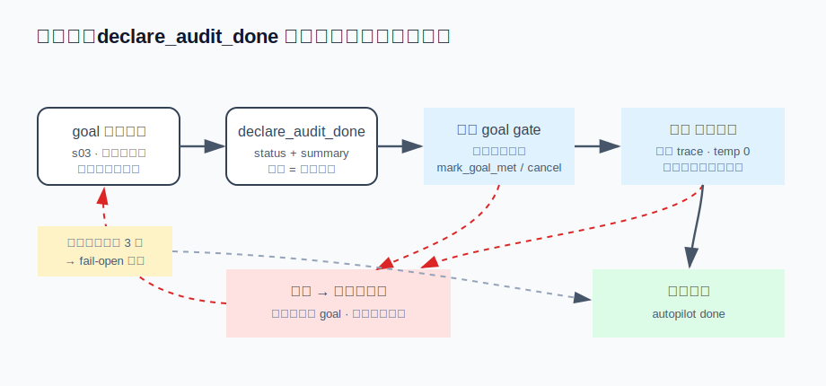

# s18 · 自主任务的完成门

自主运行的 agent 说"做完了"，凭什么信？本章把"完成"从一句话改造成一次带闸的状态转移：goal 合同收口是第一道闸，独立裁判是第二道闸，两道闸咬合，谁也别想空口关环。

## 问题

s03 解决的是模型**停不下来**（原地打转、反复报错），但自主长程任务（autopilot：用户交代一个目标就走开，agent 自己跑几十轮）暴露的是反方向的问题：**它停得太随意**。放任模型自我宣称，实测只有两种坏结局：

- **提前收工**：改了三处 bug 里的一处，总结写得漂漂亮亮——"任务已完成"。循环关了，没人发现；
- **原地瘫痪**（narrate-then-stop）：每轮都输出一段"接下来我将……"的计划，然后不调任何工具就结束。任务没完成，循环也没关，烧着 token 空转。

两种结局的共同根源是：**"任务是否完成"这个判断，由干活的模型自己做**。它写总结的那只手，和它给总结打分的那只手，是同一只手。

## 解决方案

把"完成"做成一个工具调用（`declare_audit_done`），在它关掉循环之前串两道闸：

- **闸一 · goal gate**：任务开始时立下的 goal 合同还有没收口的，直接拒绝——要么拿证据盖章（`mark_goal_met`），要么给理由放弃（`cancel_goal`）；
- **闸二 · 独立裁判**：一次**单独的模型调用**读压缩后的执行轨迹，裁定目标是否真的达成。不过闸就带着反馈打回循环，还把没达标的 goal 重新打开——下次再宣称，先撞回闸一。



## 运行

演示不需要 API key：

```sh
node s18_completion_gate/demo.mjs
```

四个场景，真实运行输出（节选）：

```
━━━ 场景二：goal gate —— 合同没收口，declare 被拒 ━━━
  第 1 次 declare：Cannot declare_audit_done — 1 goal(s) still active:
  │   - goal-2: parser.ts 的 3 处越界读取全部修复，npm test 回归全绿
  自我盖章后再 declare：<autopilot done status=complete>
  → goal gate 只查合同状态，不查证据质量 —— 需要第二道闸。

━━━ 场景三：独立裁判 —— 自我盖章过不了第二道闸 ━━━
  declare（裁判第 1 轮）：Independent verification did NOT confirm completion (round 1/3).
  │ 理由：轨迹里没有任何验证动作，只有编辑
  │ 下一步：跑一遍回归测试，把 exit code 和通过数附进 goal 证据里
  declare（裁判第 2 轮）：<autopilot done status=complete>
  裁判读的 trace：415 字符（transcript 17906 字符 → 只看形状，不逐字重放）

━━━ 场景四：裁判卡死 —— verifyRounds 上限 + fail-open ━━━
  第 3 次 declare：Independent verification did NOT confirm completion (round 3/3).
  第 4 次 declare：<autopilot done status=complete> （accepted after 3 verify round(s)）
```

## 实现

### ① 完成是一个工具调用，不是一段话

"我做完了"如果只是 assistant 文本，循环就得靠猜（"这段话像不像结束语？"）来关环。把它做成工具 `declare_audit_done({status, summary})`，完成就变成一个**可拦截的结构化事件**：闸的逻辑全部长在工具的执行路径上，拒绝的理由就从工具结果原路返回——报错是写给模型看的界面（s02 的原则），每条拒绝都附带下一步操作指引。

### ② 闸一 · goal gate：合同没收口，不许关环

goal 是任务开始时立下的合同（"3 处越界全部修复，回归全绿"）。declare 时还有 `active` 状态的 goal，直接拒绝：

```
Cannot declare_audit_done — 1 goal(s) still active:
  - goal-2: parser.ts 的 3 处越界读取全部修复，npm test 回归全绿
满足了就 mark_goal_met({goalId, evidence})，做不了就 cancel_goal({goalId, reason})，然后重试。
```

出口有两个且必须二选一：拿证据盖章，或给理由放弃——"做不了"也要显式说出来，不能靠沉默混过去。但场景二暴露了这道闸的上限：它**只查合同状态，不查证据质量**。模型拿"我已仔细检查过"给自己盖章，闸一照样放行。

### ③ 闸二 · 独立裁判：换一只手打分

裁判是一次单独的模型调用，temperature 0，只回 JSON（`{pass, reason, feedback, unmetGoalIds}`）。system prompt 里写死怀疑论："没有具体证据（工具输出、文件改动、测试结果）的漂亮总结不算数，拿不准就 pass=false"。它看的不是原始 transcript，而是一份**压缩轨迹**（demo 里 1.8 万字符压到 415）：

- 轮数、消息数、token 用量——工作量的形状；
- 工具调用**序列**（只有名字，没有参数）——干活的形状：只有 edit 没有 test，一眼看穿；
- 最近 8 条 assistant 叙述（每条截 200 字符）+ goal 合同与盖章证据 + 最终宣称。

"目标是否达成"这个问题从不需要逐字重放，压缩轨迹让裁判调用小到可以忽略。裁定不过时，引擎把 `unmetGoalIds` 点名的 goal **重新打开**（只在本轮盖过章的 goal 里选，防止裁判越权重开历史 goal），把 `feedback` 作为工具错误返回——于是两道闸咬合成一个环：裁判打回 → goal 重开 → 下次 declare 先撞闸一 → 模型必须真正干活、拿新证据盖章，才能再见到裁判。

### ④ 防困死：闸是闸，不是牢

拦截机制的镜像风险是把一个**已完成**的任务困死在循环里。四道保险，一道都不能少：

- **verifyRounds 上限**（默认 3）：裁判连拒 3 轮后放行——宁可放过，不困死。上限在每次新的 goal 续跑时清零，否则一个 goal 攒满 3 次拒绝，这个计数器就永久卡死，后续所有校验形同虚设；
- **fail-open**：裁判调用本身失败（网络、超时、回了段散文解析不出 JSON）默认放行——校验是增强，不能成为新的单点故障；
- **cancel_goal 出口**：真死路（同一个阻塞条件连续三轮不动）允许显式放弃，但提示词写明"不许因为难、慢、预算快烧完就放弃"；
- **总轮数上限 + 停滞检测**：continuation 有硬顶（Reina 默认 50 轮），连续多轮无新进展信号自动判 exhausted——外层兜底，防止两道闸和模型玩出无限往复。

### 接进真实 agent

挂载点全在 `declare_audit_done` 的工具执行路径里，s01 的循环一行不改：闸一是几行同步检查；闸二复用现成的模型调用管线（s14 的 provider 层），裁判模型默认复用压缩模型的配置。autopilot 的续跑本身就是 s03 的老机制——每轮结束时若还有 active goal，注入一条合成的续跑提示（带轮数预算和上一轮裁判反馈）再跑一轮；裁判反馈就是顺着这条既有通道回到模型眼前的，不需要任何新信道。

## 练习

1. 场景三的裁判只看工具**名字**，所以 `run_shell("echo ok")` 也能冒充"跑过测试"。给压缩轨迹的每个工具调用附上结果的第一行（截 80 字符），让裁判能分辨 `npm test → 41/41 passed` 和 `echo ok`。代价是什么？算一下 50 轮任务的轨迹会涨到多大，值不值。
2. 场景四的 fail-open 对"改错代码"是对的（放过一个完成的任务，损失有限），但如果这个 autopilot 的最后一步是 `npm publish` 呢？设计一个按 goal 风险分级的策略：哪些 goal 的校验失败应该 fail-closed（宁可困住，不许放行），并想清楚 fail-closed 之后谁来解锁——上限到了不放行，出口只剩用户，这其实是 s13 权限闸的形状。

## 与真实产品对照（延伸阅读）

本章是 Reina autopilot 完成门的简化版，生产实现分三处：

- **闸一**在 `packages/core/src/controllers/audit.ts`：goal gate 的注释里直接写着它模仿的对象——Claude Code 的 harness 级 Stop hook（agent 想结束时 hook 可以拒绝并塞回一条指令）。区别在于 CC 的 Stop hook 是用户写的外部脚本，Reina 把"合同没收口不许停"做成了内置语义；
- **闸二**在 `packages/core/src/autopilot/verifier.ts`：`buildVerifyTrace` 四段式压缩轨迹（上限 16000 字符）、temperature 0、宽容的 JSON 提取（模型把 JSON 裹在散文里也能捞出来）。文件头的设计笔记记录了它从 chainreactors/aiscan 的 evaluator 借了什么（压缩轨迹、硬及格线、结构化裁定）、刻意没借什么（aiscan 的"重置上下文 + 自包含反馈"是没有压缩子系统时的替代品，Reina 有 s06 的真压缩，被拒后直接回续跑循环即可）；
- **防困死**在 `packages/core/src/engine.ts` 的 `verifyAutopilotCompletion`：maxRounds 默认 3、failOpen 默认开、`unmetGoalIds` 与本轮盖章的 goal 求交集后才重开、verifyRounds 随新 goal 续跑清零——最后这条是修过的真 bug：不清零的话，一个 goal 攒满拒绝次数后，这个会话余下所有校验全部静默跳过。

一个值得记的对称：s03 和本章是同一个问题的两端。s03 防"停不下来"，本章防"停得太随意"——自主循环的工程本质就是把这两个方向的出口都换成闸：想继续，过预算闸；想结束，过完成门。

---

| [← 上一章：自进化复盘环](../s17_self_evolution/README.md) | [目录](../README.md) | [下一章：压缩与缓存的冲突 →](../s19_compaction_cache/README.md) |
|---|---|---|
