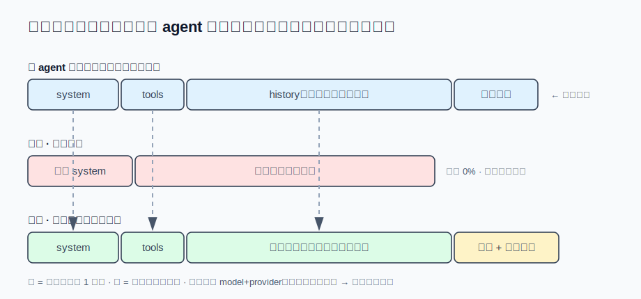

# s19 · 压缩与缓存的冲突

s06 靠改写历史活命，s07 靠历史不变省钱——这两个机制天生打架。本章算三笔账：什么时候压、摘要调用怎么计费、摘要放哪，把"必然击穿一次"的损失压到最低。

## 问题

s07 的练习 2 留过一个思考题：压缩把历史整段重写，缓存必然失效一次——压得越早，失效越频繁；压得越晚，每轮承担的未命中风险越大。这个权衡真拆开看是三个独立的问题：

1. **什么时候压**：有一个流行流派主张"每轮结束都回头修剪历史"（滚动摘要、turn-end 压缩），上下文永远保持最小。听起来很省——但每轮修剪就是每轮改写历史中段，s07 的前缀缓存每轮击穿一次；
2. **摘要调用自己怎么计费**：压缩要调一次模型做总结，这次调用得把被压的整段历史再读一遍。几万 token 的切片按全价读一遍，压缩本身就成了账单上的大项；
3. **摘要放哪**：压缩产出的摘要要让模型每轮都看见。放错位置（比如每轮追加的 system-reminder），这几千字符就每轮全价重发一遍，直到会话结束。

三个问题的共同底层是 s07 那条铁律：**前缀差一个字节，后面全价重算**。压缩的每个设计决定都要拿这条铁律过一遍。

## 解决方案

三笔账对应三个设计决定：压得**少而狠**（阈值触发，一次压掉一大段，击穿次数=压缩次数）；摘要调用**骑主 agent 刚缓存的前缀**（原样复用 system+tools+原生切片，大头按 1 折计）；摘要**一次性折进历史**（跟着前缀吃缓存，不做每轮重发的 reminder）。



## 运行

演示不需要 API key：

```sh
node s19_compaction_cache/demo.mjs
```

三笔账，真实运行输出：

```
━━━ 账一：什么时候压 ×（20 轮工具循环，计费输入 token） ━━━
  不压（计费下界参照）　　　： 38683 tok · 1.0× · 击穿  0 次 · 最终上下文 18373 tok
  阈值触发（用到 75% 才压）　： 35780 tok · 0.9× · 击穿  1 次 · 最终上下文  8889 tok（压了 1 次）
  每轮修剪（回头改写老结果）： 58952 tok · 1.5× · 击穿 17 次 · 最终上下文  5814 tok

━━━ 账二：摘要调用怎么计费（被压切片 9992 tok） ━━━
  独立请求（专用 system、扁平化文本）：命中   0.0% · 计费 10073 tok
  前缀复用（同 system+tools+原生切片）：命中  99.9% · 计费  1312 tok

━━━ 账三：摘要放哪 ×（压缩后再跑 8 轮） ━━━
  每轮系统 reminder（追在最新消息后）： 21378 tok
  一次性折进历史（restored-context）　： 18189 tok
```

注意账一里最反直觉的一行：**阈值压缩比不压还便宜**（0.9×）——压缩付了一次击穿，但换来之后每轮更短的前缀，几轮就回本。而"每轮修剪"上下文确实最小，账单却是 1.5×：省的是窗口，烧的是缓存。

## 实现

### ① 什么时候压：击穿次数 = 改写历史的次数

前缀缓存的失效点在**第一个被改动的字节**。每轮修剪流派每轮都在动历史中段，等于每轮把缓存从改动点砍断——20 轮里击穿 17 次。阈值流派 20 轮只改写一次历史，击穿一次。两者最终上下文相差无几，账单差 1.6 倍。

结论不是"永远别修剪"，而是：**改写历史是要按次付费的操作**，把它攒成低频大动作（一次压掉一大段），别摊成高频小动作（每轮修一点）。这也是为什么 s06 的触发条件是"窗口用到约 75%"而不是"每轮结束"。

### ② 摘要调用怎么计费：骑主 agent 刚缓存的前缀

压缩触发的时机很微妙：主 agent 上一轮**刚刚**把 `[system + tools + history]` 原样写进了 provider 的缓存。摘要调用如果起一个独立请求（换摘要专用 system prompt、把历史扁平化成一段文本），这个前缀一个字节都对不上——0% 命中，几万 token 全价。

快路径反着来，三个"原样"：

- **system 和 tools 原样用主 agent 的**——哪怕摘要任务根本用不到工具，也要带上，因为前缀必须逐字节相同（s07 讲过差一个字节就击穿）；
- **被压切片原样发**（native 消息，不扁平化、不过滤、不修剪）——provider 序列化出来才能和刚缓存的请求逐字节对齐；
- **摘要指令作为一条新 user 消息追在末尾**——落在缓存前缀之后，只有它是全价。

代价是围栏搬家：独立请求可以用 system prompt 关掉工具，快路径的 system 是主 agent 的（它积极鼓励用工具），所以"不许继续任务、不许调工具、只输出摘要"的围栏必须写进这条尾部指令里。模型仍可能不听话跑去调工具——此时**丢弃结果，回退独立请求重来**：最坏代价是多一次几乎全命中的调用（demo 里约 1312 tok），绝不接受一份被工具调用打断的降级摘要。

还有一个隐形开关：缓存按 **model+provider** 隔离。配了专用小模型做压缩，主 agent 的缓存对它就是不存在的，快路径自动关闭走独立请求——"用便宜模型做摘要"和"吃主模型的缓存"二选一，后者通常更便宜。

### ③ 摘要放哪：一次性折进历史

摘要写完要让模型后续每轮都看见。两个位置：

- **每轮 system-reminder**：每轮把摘要追加在最新消息附近。它永远排在本轮新增内容之后，永远落在未缓存的后缀里——一份 500 tok 的摘要，压缩后再跑 8 轮就多付 3189 tok，会话越长越亏；
- **一次性折进历史**：压缩完成时，把摘要装进一条固定的"restored-context"消息，插在被压区间的位置上。它从此就是历史的一部分——全价只付一次，之后每轮跟着前缀按 1 折计。

这条 restored-context 消息顺便解决"压缩后模型失忆"的体验问题：除了摘要，还带压缩前全文的落盘路径（s04 的指针——细节永远取得回）、最近读过的文件**路径清单**（只有路径没有内容：一份过期的文件快照比指针更危险，模型会信旧内容不信磁盘），以及一句"直接继续任务，不要复述摘要"的指令——少这句，模型会浪费一轮说"好的，我看了摘要，刚才我们在……"。

### 接进真实 agent

快路径的开关放在引擎侧最干净：只有当摘要即将跑在**和主 agent 相同的 model+provider** 上时，引擎才把这一轮的活前缀（system + tools）递给压缩模块；配了独立压缩模型、或非引擎调用方（测试、脚本），不传就是不开。压缩模块自己保持纯粹：拿到前缀就试快路径，失败回退，永远不需要知道缓存策略为什么成立。

## 练习

1. 快路径把切片原样发回给模型,切片边界就成了新的风险点：如果你的消息形状是 OpenAI 式的 `tool_calls`/`tool` 配对（s14），边界正好切在两者中间,provider 直接 400。写一个 `alignSliceBoundary(messages, splitIndex)`，保证切口永远不拆散配对——然后想想为什么把工具结果折进单条消息的形状（s16 账一用过）天然免疫这个问题。
2. 演示的计费模型是隐式前缀缓存（DeepSeek 式：自动匹配，无需声明）。Anthropic 是显式的：必须在请求里打 `cache_control` 断点，缓存只在断点处生效。快路径在 Anthropic 上还成立吗？断点应该打在哪——tools 末尾、history 末尾，还是两处都打？（提示：s07 讲过断点也算前缀的一部分，打的位置变了同样击穿。）

## 与真实产品对照（延伸阅读）

本章是 Reina 压缩管线的缓存侧切面，完整实现在 `packages/core/src/compaction.ts`：

- **快路径**是 `tryCacheFriendlySummary`：native 切片 + 主 agent 前缀 + 尾部围栏指令，defection（模型跑去调工具）或空输出一律返回 undefined 落回独立请求——"最坏多一次调用，绝不降级摘要"就是它的注释原文。Reina 的工具结果是单条 `.toolResult` 消息，所以切片边界天然切不断配对（练习 1 的免疫形状）；
- **折进历史**是 `buildPostCompactContextMessage`：注释里明确写着这是照 Codex 的 `build_compacted_history` 改的——摘要从"每轮重发的 system-reminder"搬进"一次注入的可缓存消息"，每次压缩付一次，而不是每轮付一次；
- **切分点**（`compactSplitIndex`）还有一个和缓存无关但值得抄的细节：保留区强制锚到**最后一条真实 user 消息**。否则压缩在长工具循环中途触发时，保留的全是工具结果，用户下达任务的原话被摘要成了转述——模型拿着自己对指令的复述继续跑（hermes-agent 真实事故 #10896）。外加一条防呆：要压掉的部分小于阈值就拒绝压（返回"nothing to compact"），否则 /compact 可以永远压同一条小消息，每次白付一次摘要调用。

反面对照也有一个：调研 DeepSeek-Reasonix 和 headroom 时，两者的"turn-end 每轮修剪"都被 Reina 否掉了，理由就是账一——改历史中段打断缓存前缀，省下的窗口抵不上烧掉的缓存。和 s16 的结论同款："这机制很聪明"和"这机制值得进我的产品"是两个问题，而这次的判据直接就是本章的三笔账。

---

| [← 上一章：自主任务的完成门](../s18_completion_gate/README.md) | [目录](../README.md) | [下一章：自动长期记忆 →](../s20_memory_dream/README.md) |
|---|---|---|
